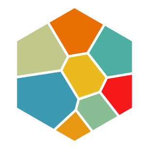
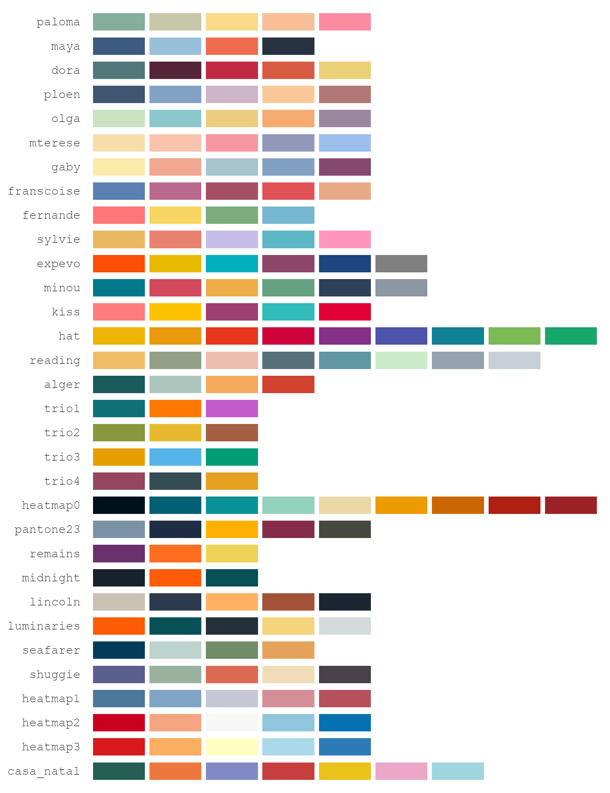

<!-- README.md is generated from README.Rmd — edit README.Rmd only, then run
     devtools::build_readme(). Pre-rendered figures (hero, shapes grid,
     palette gallery, interactive GIF) come from data-raw/readme_figures.R and
     data-raw/readme_interactive_gif.R. -->

```{r setup, include = FALSE}
knitr::opts_chunk$set(
  collapse = TRUE,
  comment  = "#>",
  fig.path = "man/figures/README-",
  fig.width = 7, fig.height = 7,
  dpi = 371,
  out.width = "60%",
  message = FALSE, warning = FALSE
)
has_ggimage  <- requireNamespace("ggimage",  quietly = TRUE)
has_ggtext   <- requireNamespace("ggtext",   quietly = TRUE)
has_showtext <- requireNamespace("showtext", quietly = TRUE)
```

# ggvmap

<!-- badges: start -->
[](https://github.com/loukesio/ggvmap/actions/workflows/R-CMD-check.yaml)
[](https://lifecycle.r-lib.org/articles/stages.html#experimental)
[](https://opensource.org/licenses/MIT)
<!-- badges: end -->

> Voronoi Map Treemaps for ggplot2

**ggvmap** partitions a convex polygon into cells whose areas are
proportional to data weights — a *Voronoi treemap*. It implements the
Nocaj & Brandes (2012) iterative power-diagram algorithm in **pure R**
(no compiled code, no CGAL, no JavaScript) with first-class
**ggplot2** integration: hierarchical (grouped) layouts, annotation
rings, flags, value labels, 32 built-in colour palettes, and interactive
hover maps.

## Installation

ggvmap is pure R with a single hard dependency (ggplot2) — no compilation,
no system libraries. Install the latest version from GitHub: 

```r
# with remotes (lightweight)
install.packages("remotes")
remotes::install_github("loukesio/ggvmap")

# ...or with devtools
devtools::install_github("loukesio/ggvmap")
```

To install a specific release, append its tag:

```r
remotes::install_github("loukesio/ggvmap@v0.3.0")
```

Some features use optional packages — install the ones you need:

```r
install.packages(c(
  "ggimage",       # vm_add_flags(), vm_add_images()
  "ggiraph",       # interactive = TRUE + vm_girafe()
  "geomtextpath",  # curved ring labels
  "ggtext",        # markdown titles
  "showtext"       # custom fonts
))
```

Then load it like any package:

```r
library(ggvmap)
```

## The one-glance demo

Everything below is drawn from one bundled dataset — `data(freshwater)`,
each country's share of global renewable freshwater (FAO Aquastat via
World Bank, 2022):

```{r hero-code, eval = FALSE}
library(ggvmap)
data(freshwater)

vm <- voronoi_map(freshwater$share, labels = freshwater$country,
                  group = freshwater$region, clip = clip_circle(),
                  seed = 5, max_iter = 80)

ggvmap(vm, palette = "casa_natal", autoscale = TRUE, min_area = 0.009,
       wrap = 10, fontface = c(Brazil = "bold")) |>
  vm_add_labels(fmt = \(v) paste0(v, "%"), autoscale = TRUE,
                min_area = 0.009) |>
  vm_add_ring(style = "arc", palette = "casa_natal", values = TRUE)
```

```{r hero, echo = FALSE, out.width = "92%", fig.align = "center"}
knitr::include_graphics("man/figures/README-hero.png")
```

The full script is [`examples/freshwater_tour.R`](examples/freshwater_tour.R).

## Quick start

`ggvmap()` computes *and* plots in one call — give it weights, or a
precomputed `voronoi_map` object:

```{r quickstart}
library(ggvmap)
data(freshwater)

top10 <- freshwater[!grepl("^Rest of|Middle East", freshwater$country), ][1:10, ]

ggvmap(top10$share, labels = top10$country, palette = "minou", seed = 42)
```

For anything beyond a quick look, the recommended workflow is two steps —
compute the layout with `voronoi_map()`, *check it*, then plot — explained
next. Every function below follows the same pattern: what it is for, the
arguments that matter (with their defaults), and a worked example. Each
example uses a different built-in palette, named in its code.

## The functions

### `voronoi_map()` — compute the layout, then check it

**What it's for:** turning a weight vector into the tessellation. This is
the expensive, seed-dependent step; everything else (plotting, labels,
rings) is cheap decoration on the object it returns.

| Argument | Default | What it does |
|---|---|---|
| `weights` | — | The numeric values; each cell's area will be proportional to its weight |
| `labels` | `NULL` | Cell names; also the names that per-cell arguments match against |
| `group` | `NULL` | Grouping vector — makes the layout *hierarchical* (one sector per group) |
| `clip` | `clip_square()` | The boundary polygon; any convex shape (see the shapes below) |
| `seed` | `NULL` | Random seed for the initial site placement — set it for reproducibility |
| `convergence_ratio` | `0.01` | Stop when total area error falls below this fraction (1%) |
| `max_iter` | `200` | Iteration budget; the layout stops here even if not converged |

The layout is an iterative optimisation with a finite budget, so it can
stop *before* cell areas match the data — and an unconverged map still
renders and looks plausible. That is why you print the object before
trusting any plot of it:

```{r voronoi-map-print}
vm <- voronoi_map(freshwater$share, labels = freshwater$country,
                  group = freshwater$region, clip = clip_circle(),
                  seed = 5, max_iter = 80)
vm
```

`Converged: TRUE` means the areas faithfully represent the weights; the
convergence percentage is the residual area error, and the iteration count
shows how much of the budget was used. If `Converged` is `FALSE`, raise
`max_iter` or try another `seed` — never publish an unconverged map.

### `clip_*()` — the boundary shapes

**What they're for:** the same weights fill *any* convex polygon with
area-true cells, so the outline is a free design choice. Ten constructors:
`clip_square()`, `clip_circle()`, `clip_hexagon()`, `clip_diamond()`,
`clip_triangle()`, `clip_pentagon()`, `clip_octagon()`,
`clip_rectangle(w, h)`, `clip_ellipse(rx, ry)`, and the general
`regular_polygon(n)`. Each panel below also names the palette it uses:

```{r shapes-grid, echo = FALSE, out.width = "85%", fig.align = "center"}
knitr::include_graphics("man/figures/README-shapes-grid.png")
```

### `ggvmap()` — render the map

**What it's for:** turning the layout into a ggplot. Everything about the
map level — colours, which labels appear and how they behave — is decided
here.

| Argument | Default | What it does |
|---|---|---|
| `palette` | `"Okabe-Ito"` | A palette name (see the palette section), colour vector, or `hcl.colors()` name |
| `autoscale` | `FALSE` | Shrink labels in small cells (down to 60% of `label_size`) |
| `min_area` | `0` | Hide labels of cells below this fraction of the map area |
| `wrap` | `NULL` | Wrap long names at this many characters (e.g. `wrap = 10`) |
| `label_size` | `3` | Text size; also takes a vector *named by cell*: `c(Brazil = 5)` |
| `label_col` | `"white"` | Text colour; also named-by-cell |
| `fontface` | `"bold"` | Face; also named-by-cell (`"plain"`, `"italic"`, `"bold.italic"`) |
| `fill_by` | `NULL` | `"data_weight"` fills by value instead of by group — see continuous fill |
| `legend` | `FALSE` | Show the fill legend |
| `interactive` | `FALSE` | Build ggiraph-interactive cells — see the interactive section |

The three label arguments above solve the problem every real dataset has —
a long tail of tiny cells and a few long names:

```{r small-cells}
ggvmap(vm, palette = "paloma", label_col = "grey15",
       autoscale = TRUE, min_area = 0.009, wrap = 10)
```

`autoscale` shrinks a label in proportion to the square root of its cell's
area relative to the median cell — so text in the *bigger half* of the map
all stays at full size (area encodes the value; the font does not
re-encode it), and only genuinely small cells shrink, floored at 60% so
they stay legible. Below `min_area`, labels disappear entirely.

### `vm_add_labels()` — value labels under the names

**What it's for:** printing each cell's value (by default its weight)
beneath the name, with free-form formatting.

| Argument | Default | What it does |
|---|---|---|
| `fmt` | `NULL` | Formatting function, e.g. `\(v) paste0(v, "%")` |
| `size` | `2.8` | Text size; also named-by-cell |
| `col` | `"grey20"` | Colour; also named-by-cell |
| `autoscale`, `min_area` | `FALSE`, `0` | Same meaning as in `ggvmap()` — **use the same `min_area` in both**, or hidden names leave orphaned values behind |
| `cells` | `NULL` | Restrict to specific cells |
| `value` | weights | Label a *different* variable than the weights |

```{r value-labels}
ggvmap(vm, palette = "sylvie", label_col = "grey15",
       autoscale = TRUE, min_area = 0.009, wrap = 10) |>
  vm_add_labels(fmt = \(v) paste0(v, "%"), autoscale = TRUE,
                min_area = 0.009)
```

### `vm_add_ring()` — label the groups without a legend

**What it's for:** wrapping a circular map in a group-aligned annotation
ring, so the reader learns the groups from the map's edge instead of a
detached legend.

| Argument | Default | What it does |
|---|---|---|
| `style` | `"band"` | `"band"` = filled ring segments; `"arc"` = thin line, label in a gap |
| `values` | `FALSE` | Append each group's share to its label ("LATAM · 31%") |
| `label_size` | `3.2` | Ring label text size (the gap in the arc scales with it) |
| `colors` | `NULL` | Override segment colours: one colour, or a vector named by group |
| `width` | `0.1` | Band thickness (band style) |
| `offset` | `0.06` | Distance of the arc from the map edge (arc style) |

The filled band:

```{r ring-band}
ggvmap(vm, palette = "gaby", label_col = "grey15",
       autoscale = TRUE, min_area = 0.009, wrap = 10) |>
  vm_add_ring(style = "band", palette = "gaby", width = 0.11)
```

The thin arc, with values. Every label sits in a gap broken into the
ring; a label wider than its own segment (here "Middle East · 1%") cuts
its gap into the neighbouring arcs too, so it never collides with them:

```{r ring-arc}
ggvmap(vm, palette = "fernande", label_col = "grey15",
       autoscale = TRUE, min_area = 0.009, wrap = 10) |>
  vm_add_ring(style = "arc", palette = "fernande", values = TRUE)
```

And with `colors =` overriding the palette — one uniform dark ring:

```{r ring-arc-dark, out.width = "48%"}
ggvmap(vm, palette = "reading", label_col = "grey15",
       autoscale = TRUE, min_area = 0.009, wrap = 10) |>
  vm_add_ring(style = "arc", colors = "#333333", values = TRUE)
```

### Emphasis — any argument, one cell at a time

**What it's for:** highlighting one cell or one group without touching
the data. `label_size`, `label_col`, `fontface` (per cell) and
`group_border_col` (per group) all accept vectors *named by* cell or
group; anything unnamed keeps the default. `label_cells` / `cells`
restrict which cells get labels at all:

```{r emphasis}
ggvmap(vm, palette = "shuggie",
       label_cells      = c("Brazil", "Russia", "Canada"),
       label_size       = c(Brazil = 5),
       label_col        = c(Brazil = "grey95", Russia = "grey15",
                            Canada = "grey15"),
       fontface         = c(Brazil = "bold.italic"),
       group_border_col = c(LATAM = "#333333")) |>
  vm_add_labels(fmt = \(v) paste0(v, "%"),
                cells = c("Brazil", "Russia", "Canada"),
                col   = c(Brazil = "grey85"))
```

### `vm_palettes()` — the built-in colours

**What it's for:** every `palette =` argument accepts, by name, all 32
palettes of the [ltc package](https://github.com/loukesio/ltc_palettes)
(vendored — ltc need not be installed). Names match case-insensitively and
ignore spaces, underscores and dashes, so `"casa_natal"`, `"Casa Natal"`
and `"casanatal"` are the same palette. `vm_palettes()` returns them all
as a named list:

```{r palettes-code, eval = FALSE}
names(vm_palettes())   # all 32 names
vm_palettes()$dora     # the hex colours of one palette
```

```{r palette-gallery, echo = FALSE, out.width = "70%", fig.align = "center"}

```

Beyond the names, `palette =` takes any colour vector, so two tricks come
free. **Softer fills**: wrap the palette in `ggplot2::alpha()` and switch
the labels to a dark colour:

```{r alpha-fills}
ggvmap(vm, palette = ggplot2::alpha(vm_palettes()$casa_natal, 0.55),
       label_col = "grey15", autoscale = TRUE, min_area = 0.009,
       wrap = 10) |>
  vm_add_labels(fmt = \(v) paste0(v, "%"), autoscale = TRUE,
                min_area = 0.009)
```

**Continuous fill**: `fill_by = "data_weight"` colours each cell by its
value, restating area as colour. The `heatmap0`–`heatmap3` palettes are
ordered ramps (always interpolated end-to-end), which makes them the
natural choice here — a qualitative palette would imply categories that
don't exist. With a ramp that reaches very dark or very light, pair it
with a matching `label_col`; the mid-tone `heatmap1` keeps dark text
readable everywhere:

```{r continuous}
ggvmap(vm, fill_by = "data_weight", palette = "heatmap1",
       label_col = "grey15", autoscale = TRUE, min_area = 0.009,
       wrap = 10, legend = TRUE)
```

### `vm_add_flags()` and `vm_add_images()` — pictures in cells

**What they're for:** `vm_add_flags()` resolves country names (English or
German) to national flags via the **ggimage** package and places them at
the cell centroids; `vm_add_images()` does the same with any image files
or URLs. Key arguments: `size` (fraction of the plot, default `0.045`),
`nudge_y` to sit the flag above the label, `cells` to restrict. The
helpers `country_to_iso()`, `flag_url()` and `flag_cache()` are exported
for custom use:

```{r flags, eval = has_ggimage}
ggvmap(top10$share, labels = top10$country, clip = clip_circle(),
       palette = "seafarer", label_col = "grey15", seed = 42) |>
  vm_add_labels(fmt = \(v) paste0(v, "%")) |>
  vm_add_flags(size = 0.05, nudge_y = 0.055)
```

### Titles and fonts

A ggvmap plot is a ggplot, so titles, themes and the wider ggplot2
ecosystem apply unchanged:

```{r titles, fig.height = 7.6}
ggvmap(top10$share, labels = top10$country, palette = "dora", seed = 42) +
  ggplot2::ggtitle("Countries with the most freshwater",
                   subtitle = "Share of global renewable freshwater, 2022") +
  ggplot2::theme(plot.title = ggplot2::element_text(face = "bold", hjust = 0.5),
                 plot.subtitle = ggplot2::element_text(colour = "grey40",
                                                       hjust = 0.5))
```

With **ggtext**, titles take markdown — handy for colour-coding words to
the map instead of using a legend:

```{r ggtext-title, eval = has_ggtext, fig.height = 7.6}
library(ggtext)
ggvmap(top10$share, labels = top10$country, palette = "luminaries", seed = 42) +
  ggplot2::labs(title = paste0(
    "**<span style='color:#FF5B04;'>Brazil</span> holds more freshwater ",
    "than any other country**")) +
  ggplot2::theme(plot.title = element_markdown(hjust = 0.5, size = 13))
```

Every text layer accepts a `family =`, so custom fonts (e.g. loaded with
**showtext**) apply directly — no `update_geom_defaults()` workaround:

```{r fonts, eval = has_showtext, fig.height = 7.2}
library(showtext)
font_add_google("Bitter", "bitter")
showtext_auto()

ggvmap(top10$share, labels = top10$country, palette = "olga",
       family = "bitter", seed = 42) |>
  vm_add_labels(fmt = \(v) paste0(v, "%"), family = "bitter")
```

### `vm_girafe()` — interactive maps

**What it's for:** hover highlighting and tooltips in HTML output
(R Markdown, Shiny, pkgdown) via **ggiraph**. Build the plot with
`ggvmap(interactive = TRUE)`, then render the widget with `vm_girafe()`
(key arguments: `width_svg`/`height_svg` in inches, `hover_css` for the
highlight style):

```{r interactive-code, eval = FALSE}
ggvmap(vm, interactive = TRUE, palette = "alger") |> vm_girafe()
```

```{r interactive-gif, echo = FALSE, out.width = "60%", fig.align = "center"}
knitr::include_graphics("man/figures/README-interactive.gif")
```

Live version (hover it yourself) in the
[Interactive article](https://loukesio.github.io/ggvmap/articles/interactive.html).

### `vm_as_df()` and `vm_centroids()` — take the data with you

**What they're for:** escaping the helpers entirely. `vm_as_df()` returns
the tessellation as a tidy data frame (one row per polygon vertex, with
cell label, group, weight, and area), and `vm_centroids()` one row per
cell centre — both ready for hand-rolled `geom_polygon()` / `geom_text()`
layers when you need something the `vm_*` verbs don't do:

```{r accessors, eval = FALSE}
df <- vm_as_df(vm)
head(df)
vm_centroids(vm)
```

## Saving your map

Two independent knobs control a saved PNG, and confusing them is the #1
source of "why are my letters tiny / why is everything overlapping":

* **`width`/`height` in pixels** = how big (and how sharp) the image is.
* **`dpi`** = how big the *letters* are relative to the map. More dpi =
  bigger text, same pixels.

```r
ggsave("map.png", p, width = 2600, height = 2600, units = "px",
       dpi = 350, bg = "white")
```

Rules of thumb:

* **Square canvas for circular maps** — on a wide rectangle the circle is
  limited by the height and the rest is wasted margin.
* Letters too small → raise `dpi` a notch (350 → 400). Labels overlapping
  → lower it. The pixel size never changes.
* `bg = "white"` — otherwise the PNG is transparent, which some viewers
  display as black.
* For print/journals, save a vector format instead — `ggsave("map.pdf")`
  — which has no resolution at all.

## How it works

The algorithm is like a **room full of balloons**: each balloon wants to
claim space proportional to its importance. Every iteration, each balloon
drifts toward the centre of its current territory (position adaptation)
and inflates or deflates to grab the right amount of area
(weight adaptation). After enough rounds, the room is perfectly partitioned.

Under the hood, it's an iterative **power diagram** (weighted Voronoi
tessellation) following:

> Nocaj, A. & Brandes, U. (2012). "Computing Voronoi Treemaps — Faster,
> Simpler, and Resolution-independent."
> *Computer Graphics Forum*, 31(3), 855–864.
> doi:10.1111/j.1467-8659.2012.03078.x

## Is it correct?

Yes — and it's verified. The tessellation is an *exact* power diagram (to
floating-point precision): cells satisfy the defining minimum-power-distance
property, tile the domain with no gaps or overlaps, are all convex, and the
hierarchical layout is a valid nested power diagram. These invariants are
enforced by `tests/testthat/test-correctness.R` and explained in the
[Correctness article](https://loukesio.github.io/ggvmap/articles/validation.html).

## Example gallery

More worked examples (with code) live in [`examples/`](examples/) — grouped
layouts, custom rings, flags on different shapes, and a combined infographic.

## API reference

| Function | Purpose |
|---|---|
| `voronoi_map()` | Core computation (add `group =` for a hierarchical layout); print it to check convergence |
| `ggvmap()` | The main ggplot2 visualisation (`autoscale`, `min_area`, `wrap`, per-cell `label_size` / `label_col` / `fontface`, `fill_by`, `family`) |
| `autoplot()` | Alias for `ggvmap()` via the ggplot2 generic |
| `plot()` | Base R visualisation |
| `vm_add_ring()` | Outer annotation ring: `style = "band"` or `"arc"` (with `values`, `colors`, `label_size`, `offset`) |
| `vm_add_flags()` | Add country flags at cell centroids |
| `vm_add_images()` | Add arbitrary images at cell centroids |
| `vm_add_labels()` | Add value labels (`fmt`, `inside`, `autoscale`, `min_area`, per-cell `size` / `col`) |
| `vm_girafe()` | Render an `interactive = TRUE` plot as a hoverable widget |
| `vm_palettes()` | List the 32 built-in colour palettes |
| `vm_as_df()` / `vm_centroids()` | Tidy data frame / centroids |
| `country_to_iso()` / `flag_url()` / `flag_cache()` | Flag helpers |
| `clip_square()` / `clip_hexagon()` / `clip_circle()` / `clip_diamond()` / `regular_polygon()` | Boundary shapes |

## Comparison with other R packages

| Feature | ggvmap | voronoiTreemap | WeightedTreemaps |
|---|---|---|---|
| Backend | Pure R | D3.js (htmlwidget) | C++ / CGAL |
| ggplot2 native | ✅ | ❌ | ❌ |
| Dependencies | ggplot2 only | htmlwidgets, d3 | RcppCGAL |
| Hierarchical | ✅ (grouped) | ✅ | ✅ |
| Annotation ring / flags | ✅ | ❌ | ❌ |
| Custom shapes | ✅ any convex | ✅ | ✅ |
| Install complexity | Trivial | Medium | Hard (CGAL) |

## Acknowledgements

This package started from the Stack Overflow question
[Make a circular Voronoi diagram in R](https://stackoverflow.com/questions/71799205/make-a-circular-voronoi-diagram-in-r),
and owes a lot to the inspiration of
[Allan Cameron](https://stackoverflow.com/users/12500315/allan-cameron)'s
answer there — thank you, Allan.

## License

MIT © 2026 Loukas Theodosiou — see [LICENSE.md](LICENSE.md) for the full
text. (The two-line [LICENSE](LICENSE) file is the CRAN-required stub
that points to the same terms.)
