<!-- README.md is generated from README.Rmd — edit README.Rmd only, then run
     devtools::build_readme(). Pre-rendered figures (hero, shapes grid,
     palette gallery, interactive GIF) come from data-raw/readme_figures.R and
     data-raw/readme_interactive_gif.R. -->

# ggvmap

<!-- badges: start -->

[](https://github.com/loukesio/ggvmap/actions/workflows/R-CMD-check.yaml)
[](https://lifecycle.r-lib.org/articles/stages.html#experimental)
[](https://opensource.org/licenses/MIT)
<!-- badges: end -->

> Voronoi Map Treemaps for ggplot2

**ggvmap** partitions an outline into cells whose areas are proportional
to data weights — a *Voronoi treemap*. It implements the Nocaj & Brandes
(2012) iterative power-diagram approach with native **ggplot2** output.
The original `voronoi_map()` solver is written in **pure R** and
supports convex outlines, grouped layouts, annotation rings, flags,
value labels, 32 built-in colour palettes, and interactive hover maps.

For real outlines, `vmap_region()` adds inward bends, holes, and
disconnected pieces through optional `polyclip`, with optional `sf`
input for geographic boundaries. These optional packages use compiled
geometry libraries. [Try a real
outline](#fit-values-inside-real-outlines).

## Installation

ggvmap’s own code is R, and ggplot2 is its only required non-base
package. The optional region feature additionally needs `polyclip`;
geographic `sf` input also needs `sf`. Install the latest development
version from GitHub:


``` r
# with remotes (lightweight)
install.packages("remotes")
remotes::install_github("loukesio/ggvmap")

# ...or with devtools
devtools::install_github("loukesio/ggvmap")
```

To install a specific release, append its tag:

``` r
remotes::install_github("loukesio/ggvmap@v0.3.0")
```

Some features use optional packages — install the ones you need:

``` r
install.packages(c(
  "polyclip",      # vmap_region()
  "sf",            # geographic boundary input
  "ggimage",       # vm_add_flags(), vm_add_images()
  "ggiraph",       # interactive = TRUE + vm_girafe()
  "geomtextpath",  # curved ring labels
  "ggtext",        # markdown titles
  "showtext"       # custom fonts
))
```

Then load it like any package:

``` r
library(ggvmap)
```

## The one-glance demo

The core feature tour uses one bundled dataset — `data(freshwater)`,
each country’s share of global renewable freshwater (FAO Aquastat via
World Bank, 2022):

``` r
library(ggvmap)
data(freshwater)

vm <- voronoi_map(freshwater$share, labels = freshwater$country,
                  group = freshwater$region, clip = clip_circle(),
                  seed = 5, max_iter = 80)

ggvmap(vm, palette = "casa_natal", autoscale = TRUE, min_area = 0.009,
       wrap = 10, fontface = c(Brazil = "bold")) |>
  vm_add_labels(fmt = \(v) paste0(v, "%"), autoscale = TRUE,
                min_area = 0.009) |>
  vm_add_ring(style = "arc", palette = "casa_natal", values = TRUE)
```


The full script is
[`examples/freshwater_tour.R`](examples/freshwater_tour.R).

## Quick start

`ggvmap()` computes *and* plots in one call — give it weights, or a
precomputed `voronoi_map` object:

``` r
library(ggvmap)
data(freshwater)

top10 <- freshwater[!grepl("^Rest of|Middle East", freshwater$country), ][1:10, ]

ggvmap(top10$share, labels = top10$country, palette = "minou", seed = 42)
```

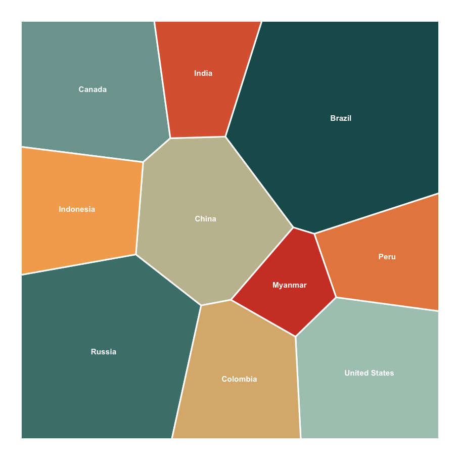

For anything beyond a quick look, the recommended workflow is two steps
— compute the layout with `voronoi_map()`, *check it*, then plot —
explained next. Every function below follows the same pattern: what it
is for, the arguments that matter (with their defaults), and a worked
example. Each example uses a different built-in palette, named in its
code.

## The functions

### `voronoi_map()` — compute the layout, then check it

**What it’s for:** turning a weight vector into the tessellation. This
is the expensive, seed-dependent step; everything else (plotting,
labels, rings) is cheap decoration on the object it returns.

| Argument | Default | What it does |
|----|----|----|
| `weights` | — | The numeric values; each cell’s area will be proportional to its weight |
| `labels` | `NULL` | Cell names; also the names that per-cell arguments match against |
| `group` | `NULL` | Grouping vector — makes the layout *hierarchical* (one sector per group) |
| `clip` | `clip_square()` | The boundary polygon; any convex shape (see the shapes below) |
| `seed` | `NULL` | Random seed for the initial site placement — set it for reproducibility |
| `convergence_ratio` | `0.01` | Stop when total area error falls below this fraction (1%) |
| `max_iter` | `200` | Iteration budget; the layout stops here even if not converged |

The layout is an iterative optimisation with a finite budget, so it can
stop *before* cell areas match the data — and an unconverged map still
renders and looks plausible. That is why you print the object before
trusting any plot of it:

``` r
vm <- voronoi_map(freshwater$share, labels = freshwater$country,
                  group = freshwater$region, clip = clip_circle(),
                  seed = 5, max_iter = 80)
vm
#> Voronoi Map
#>   hierarchical | 6 groups | 30 cells
#>   30 cells | 26 iterations | convergence: 0.789%
#>   Converged: TRUE
```

`Converged: TRUE` means the areas faithfully represent the weights; the
convergence percentage is the residual area error, and the iteration
count shows how much of the budget was used. If `Converged` is `FALSE`,
raise `max_iter` or try another `seed` — never publish an unconverged
map.

### `clip_*()` — the boundary shapes

**What they’re for:** the same weights fill *any* convex polygon with
area-true cells, so the outline is a free design choice. Ten
constructors: `clip_square()`, `clip_circle()`, `clip_hexagon()`,
`clip_diamond()`, `clip_triangle()`, `clip_pentagon()`,
`clip_octagon()`, `clip_rectangle(w, h)`, `clip_ellipse(rx, ry)`, and
the general `regular_polygon(n)`. Each panel below also names the
palette it uses:


### `ggvmap()` — render the map

**What it’s for:** turning the layout into a ggplot. Everything about
the map level — colours, which labels appear and how they behave — is
decided here.

| Argument | Default | What it does |
|----|----|----|
| `palette` | `"Okabe-Ito"` | A palette name (see the palette section), colour vector, or `hcl.colors()` name |
| `autoscale` | `FALSE` | Shrink labels in small cells (down to 60% of `label_size`) |
| `min_area` | `0` | Hide labels of cells below this fraction of the map area |
| `wrap` | `NULL` | Wrap long names at this many characters (e.g. `wrap = 10`) |
| `label_size` | `3` | Text size; also takes a vector *named by cell*: `c(Brazil = 5)` |
| `label_col` | `"white"` | Text colour; also named-by-cell |
| `fontface` | `"bold"` | Face; also named-by-cell (`"plain"`, `"italic"`, `"bold.italic"`) |
| `fill_by` | `NULL` | `"data_weight"` fills by value instead of by group — see continuous fill |
| `legend` | `FALSE` | Show the fill legend |
| `interactive` | `FALSE` | Build ggiraph-interactive cells — see the interactive section |

The three label arguments above solve the problem every real dataset has
— a long tail of tiny cells and a few long names:

``` r
ggvmap(vm, palette = "paloma", label_col = "grey15",
       autoscale = TRUE, min_area = 0.009, wrap = 10)
```

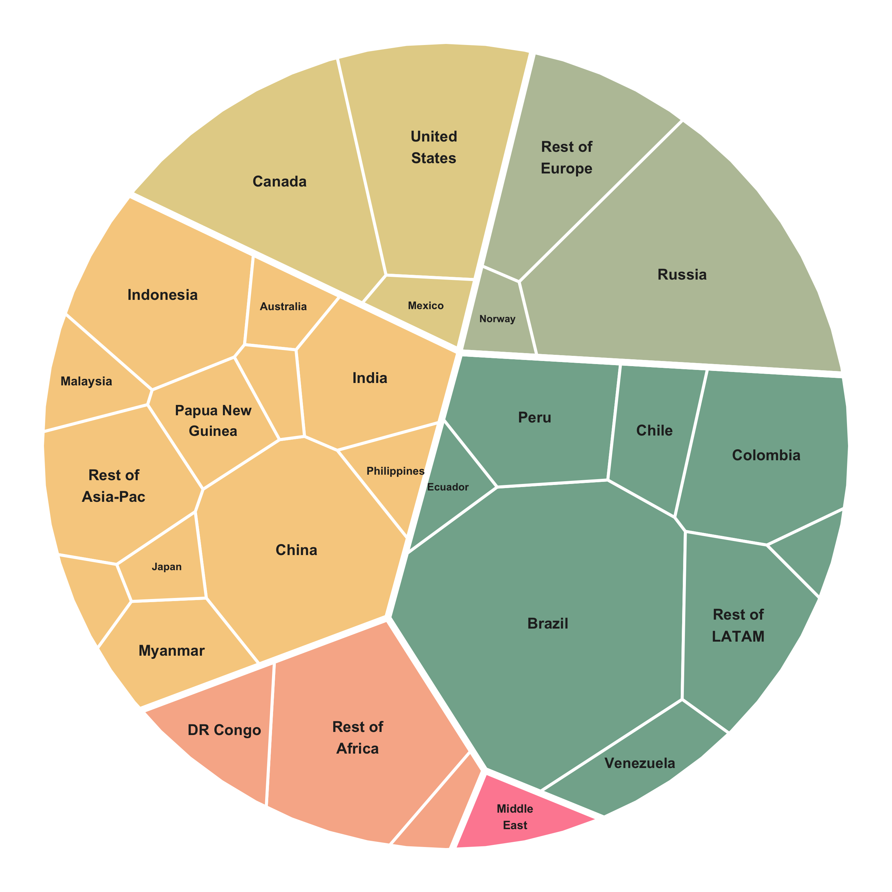

`autoscale` shrinks a label in proportion to the square root of its
cell’s area relative to the median cell — so text in the *bigger half*
of the map all stays at full size (area encodes the value; the font does
not re-encode it), and only genuinely small cells shrink, floored at 60%
so they stay legible. Below `min_area`, labels disappear entirely.

### `vm_add_labels()` — value labels under the names

**What it’s for:** printing each cell’s value (by default its weight)
beneath the name, with free-form formatting.

| Argument | Default | What it does |
|----|----|----|
| `fmt` | `NULL` | Formatting function, e.g. `\(v) paste0(v, "%")` |
| `size` | `2.8` | Text size; also named-by-cell |
| `col` | `"grey20"` | Colour; also named-by-cell |
| `autoscale`, `min_area` | `FALSE`, `0` | Same meaning as in `ggvmap()` — **use the same `min_area` in both**, or hidden names leave orphaned values behind |
| `cells` | `NULL` | Restrict to specific cells |
| `value` | weights | Label a *different* variable than the weights |

``` r
ggvmap(vm, palette = "sylvie", label_col = "grey15",
       autoscale = TRUE, min_area = 0.009, wrap = 10) |>
  vm_add_labels(fmt = \(v) paste0(v, "%"), autoscale = TRUE,
                min_area = 0.009)
```

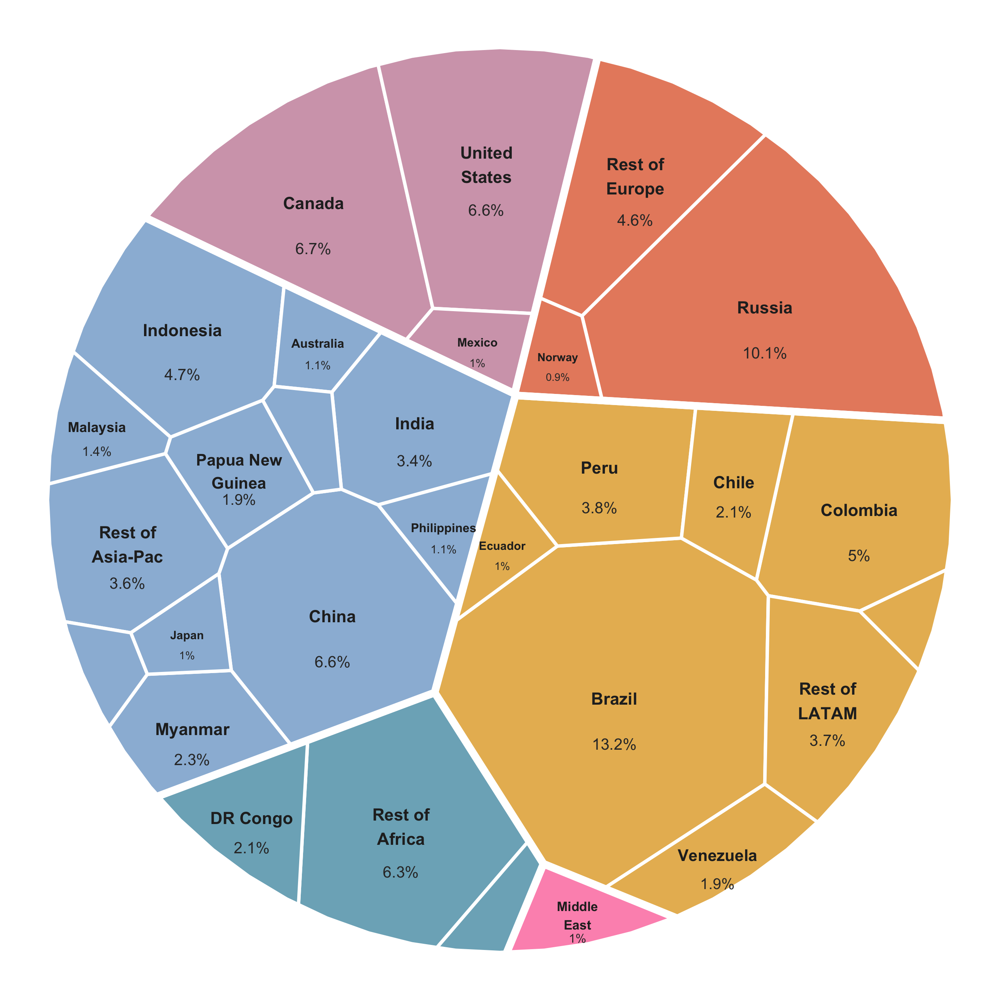

### `vm_add_ring()` — label the groups without a legend

**What it’s for:** wrapping a circular map in a group-aligned annotation
ring, so the reader learns the groups from the map’s edge instead of a
detached legend.

| Argument | Default | What it does |
|----|----|----|
| `style` | `"band"` | `"band"` = filled ring segments; `"arc"` = thin line, label in a gap |
| `values` | `FALSE` | Append each group’s share to its label (“LATAM · 31%”) |
| `label_size` | `3.2` | Ring label text size (the gap in the arc scales with it) |
| `colors` | `NULL` | Override segment colours: one colour, or a vector named by group |
| `width` | `0.1` | Band thickness (band style) |
| `offset` | `0.06` | Distance of the arc from the map edge (arc style) |

The filled band:

``` r
ggvmap(vm, palette = "gaby", label_col = "grey15",
       autoscale = TRUE, min_area = 0.009, wrap = 10) |>
  vm_add_ring(style = "band", palette = "gaby", width = 0.11)
```

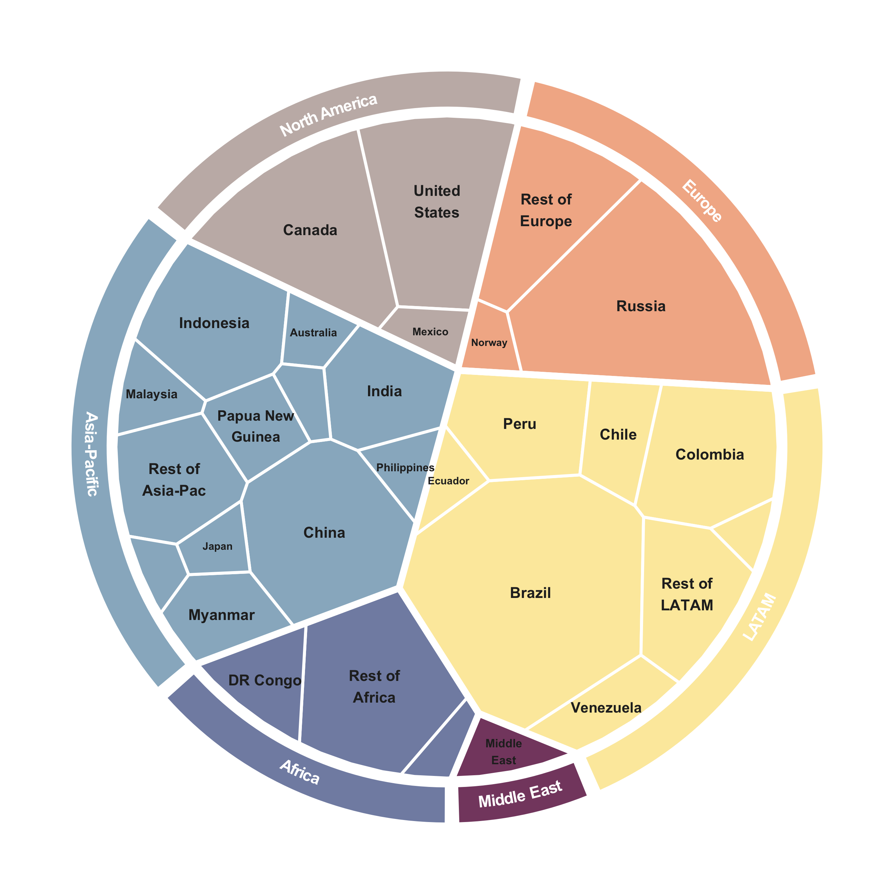

The thin arc, with values. Every label sits in a gap broken into the
ring; a label wider than its own segment (here “Middle East · 1%”) cuts
its gap into the neighbouring arcs too, so it never collides with them:

``` r
ggvmap(vm, palette = "fernande", label_col = "grey15",
       autoscale = TRUE, min_area = 0.009, wrap = 10) |>
  vm_add_ring(style = "arc", palette = "fernande", values = TRUE)
```

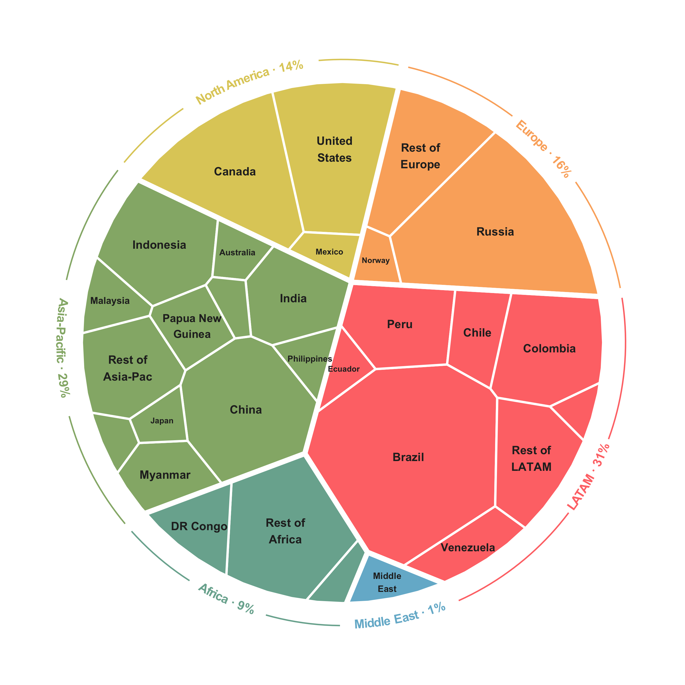

And with `colors =` overriding the palette — one uniform dark ring:

``` r
ggvmap(vm, palette = "reading", label_col = "grey15",
       autoscale = TRUE, min_area = 0.009, wrap = 10) |>
  vm_add_ring(style = "arc", colors = "#333333", values = TRUE)
```

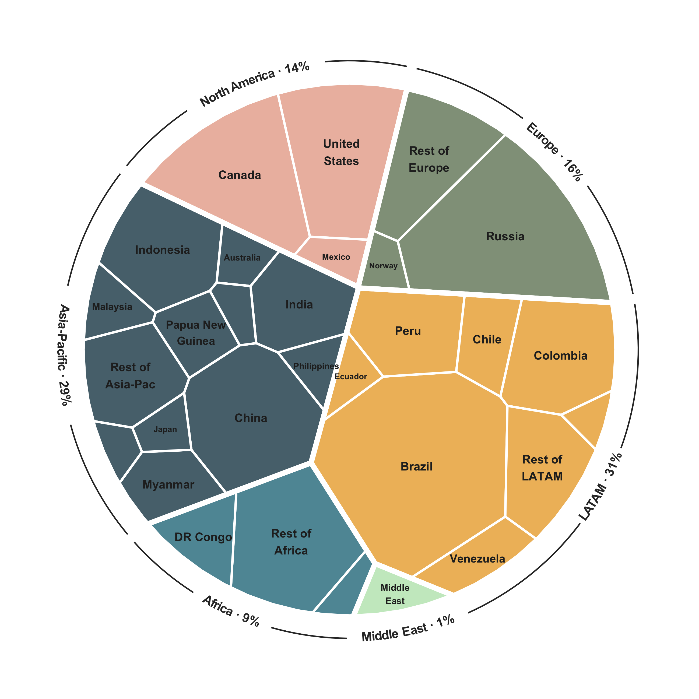

### Emphasis — any argument, one cell at a time

**What it’s for:** highlighting one cell or one group without touching
the data. `label_size`, `label_col`, `fontface` (per cell) and
`group_border_col` (per group) all accept vectors *named by* cell or
group; anything unnamed keeps the default. `label_cells` / `cells`
restrict which cells get labels at all:

``` r
ggvmap(vm, palette = "shuggie",
       label_cells      = c("Brazil", "Russia", "Canada"),
       label_size       = c(Brazil = 5),
       label_col        = c(Brazil = "grey95", Russia = "grey15",
                            Canada = "grey15"),
       fontface         = c(Brazil = "bold.italic"),
       group_border_col = c(LATAM = "#333333")) |>
  vm_add_labels(fmt = \(v) paste0(v, "%"),
                cells = c("Brazil", "Russia", "Canada"),
                col   = c(Brazil = "grey85"))
```

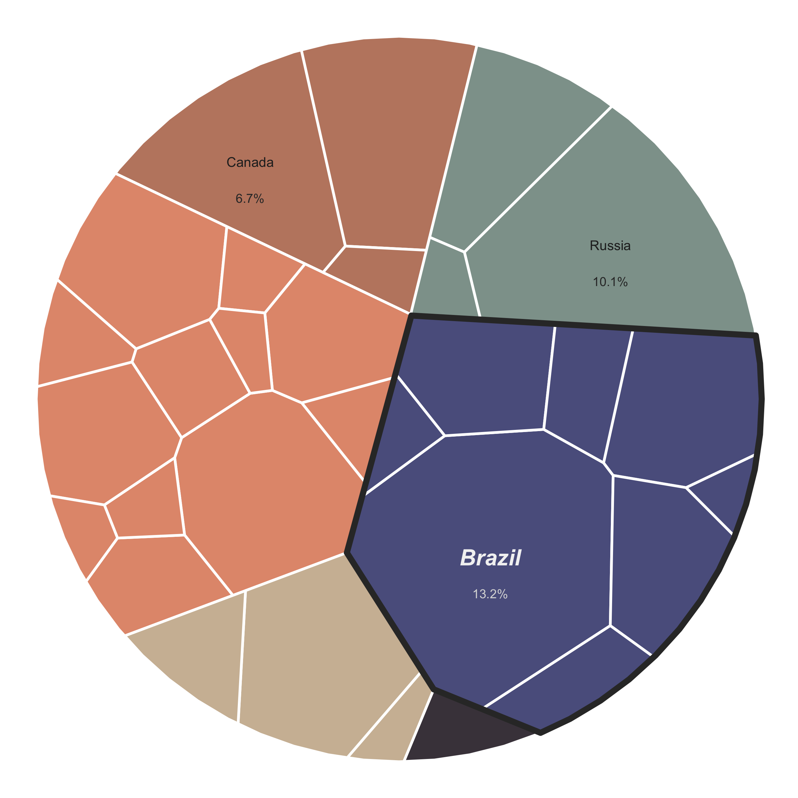

### `vm_palettes()` — the built-in colours

**What it’s for:** every `palette =` argument accepts, by name, all 32
palettes of the [ltc package](https://github.com/loukesio/ltc_palettes)
(vendored — ltc need not be installed). Names match case-insensitively
and ignore spaces, underscores and dashes, so `"casa_natal"`,
`"Casa Natal"` and `"casanatal"` are the same palette. `vm_palettes()`
returns them all as a named list:

``` r
names(vm_palettes())   # all 32 names
vm_palettes()$dora     # the hex colours of one palette
```


Beyond the names, `palette =` takes any colour vector, so two tricks
come free. **Softer fills**: wrap the palette in `ggplot2::alpha()` and
switch the labels to a dark colour:

``` r
ggvmap(vm, palette = ggplot2::alpha(vm_palettes()$casa_natal, 0.55),
       label_col = "grey15", autoscale = TRUE, min_area = 0.009,
       wrap = 10) |>
  vm_add_labels(fmt = \(v) paste0(v, "%"), autoscale = TRUE,
                min_area = 0.009)
```

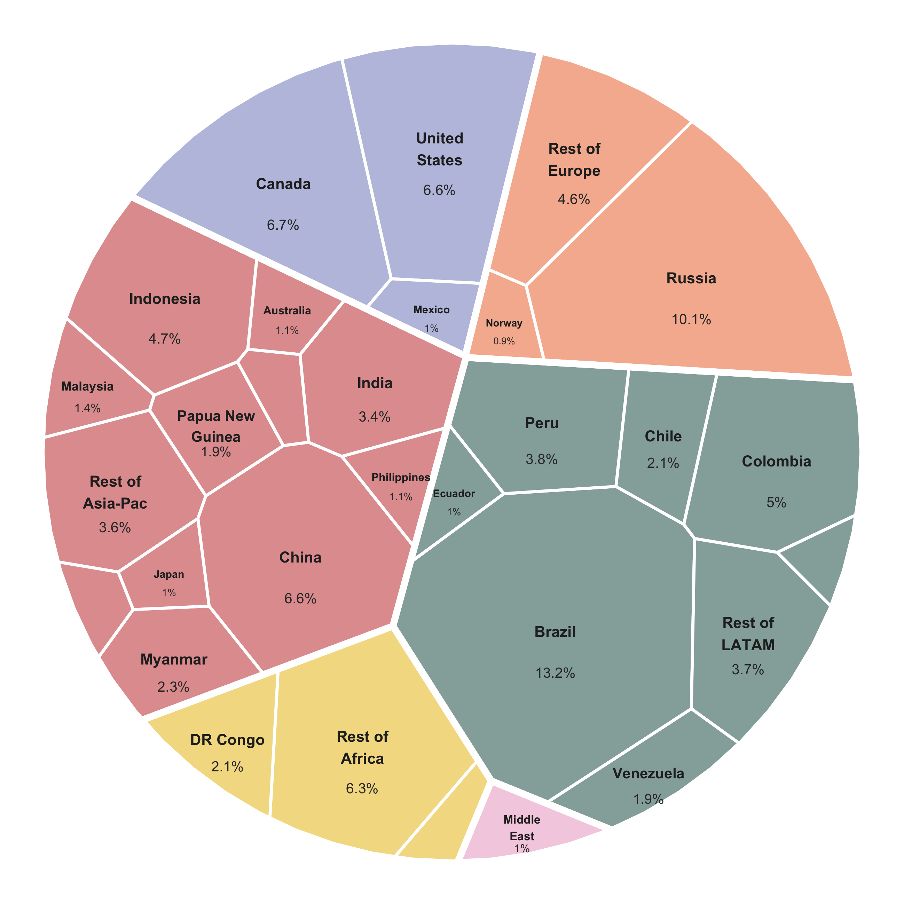

**Continuous fill**: `fill_by = "data_weight"` colours each cell by its
value, restating area as colour. The `heatmap0`–`heatmap3` palettes are
ordered ramps (always interpolated end-to-end), which makes them the
natural choice here — a qualitative palette would imply categories that
don’t exist. With a ramp that reaches very dark or very light, pair it
with a matching `label_col`; the mid-tone `heatmap1` keeps dark text
readable everywhere:

``` r
ggvmap(vm, fill_by = "data_weight", palette = "heatmap1",
       label_col = "grey15", autoscale = TRUE, min_area = 0.009,
       wrap = 10, legend = TRUE)
```

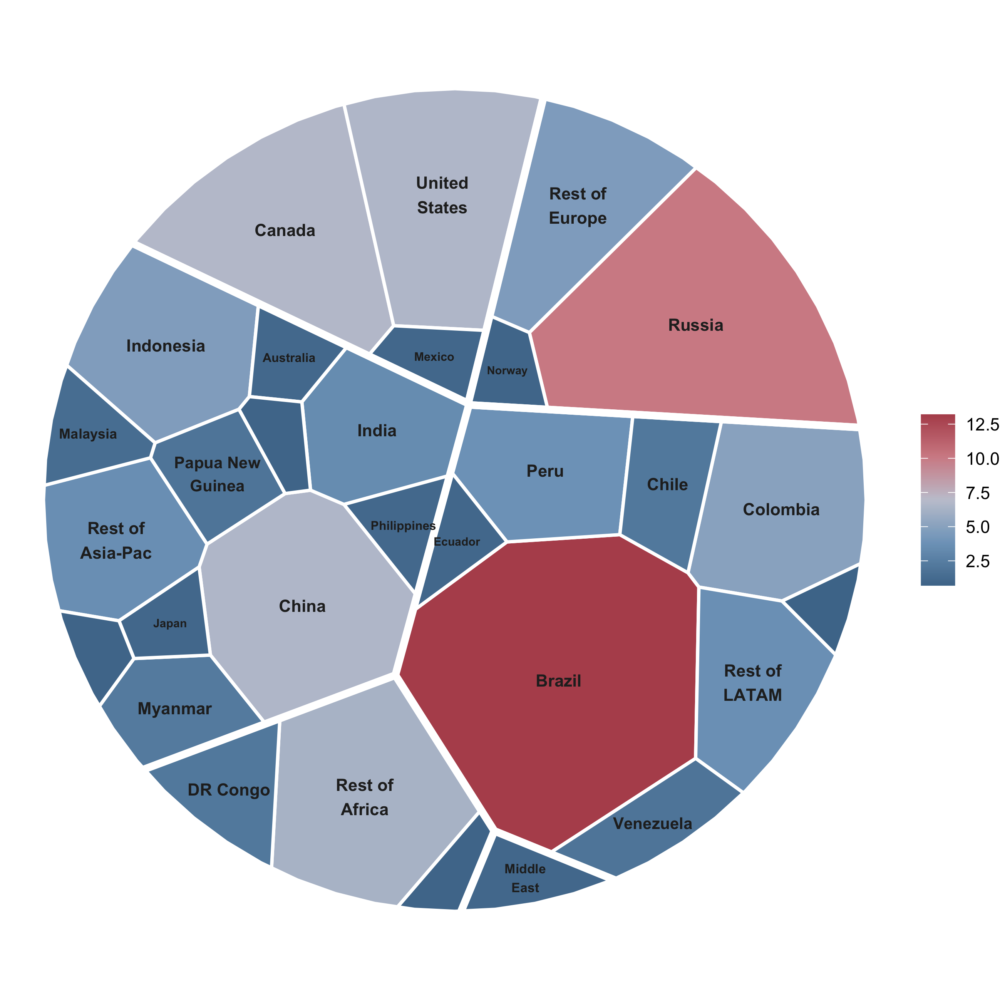

### `vm_add_flags()` and `vm_add_images()` — pictures in cells

**What they’re for:** `vm_add_flags()` resolves country names (English
or German) to national flags via the **ggimage** package and places them
at the cell centroids; `vm_add_images()` does the same with any image
files or URLs. Key arguments: `size` (fraction of the plot, default
`0.045`), `nudge_y` to sit the flag above the label, `cells` to
restrict. The helpers `country_to_iso()`, `flag_url()` and
`flag_cache()` are exported for custom use:

``` r
ggvmap(top10$share, labels = top10$country, clip = clip_circle(),
       palette = "seafarer", label_col = "grey15", seed = 42) |>
  vm_add_labels(fmt = \(v) paste0(v, "%")) |>
  vm_add_flags(size = 0.05, nudge_y = 0.055)
```

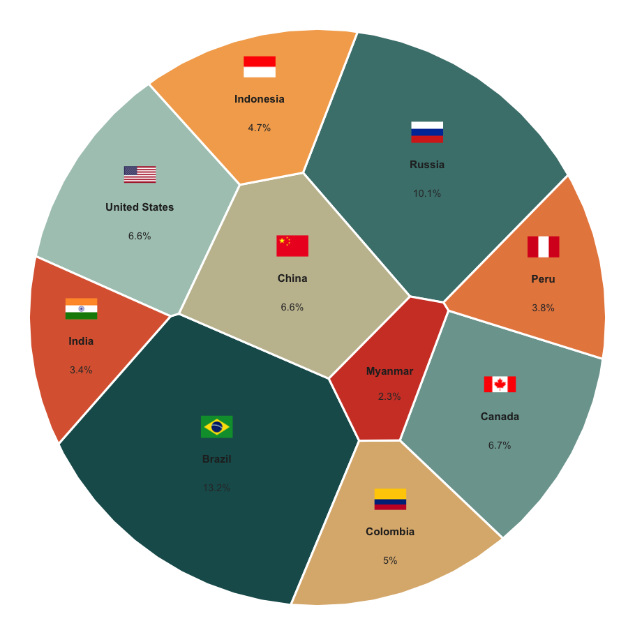

### Titles and fonts

A ggvmap plot is a ggplot, so titles, themes and the wider ggplot2
ecosystem apply unchanged:

``` r
ggvmap(top10$share, labels = top10$country, palette = "dora", seed = 42) +
  ggplot2::ggtitle("Countries with the most freshwater",
                   subtitle = "Share of global renewable freshwater, 2022") +
  ggplot2::theme(plot.title = ggplot2::element_text(face = "bold", hjust = 0.5),
                 plot.subtitle = ggplot2::element_text(colour = "grey40",
                                                       hjust = 0.5))
```

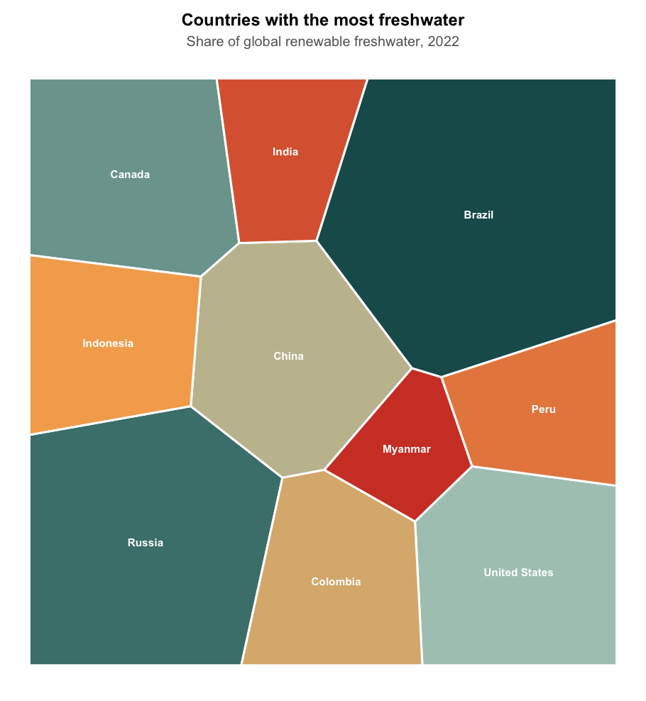

With **ggtext**, titles take markdown — handy for colour-coding words to
the map instead of using a legend:

``` r
library(ggtext)
ggvmap(top10$share, labels = top10$country, palette = "luminaries", seed = 42) +
  ggplot2::labs(title = paste0(
    "**<span style='color:#FF5B04;'>Brazil</span> holds more freshwater ",
    "than any other country**")) +
  ggplot2::theme(plot.title = element_markdown(hjust = 0.5, size = 13))
```

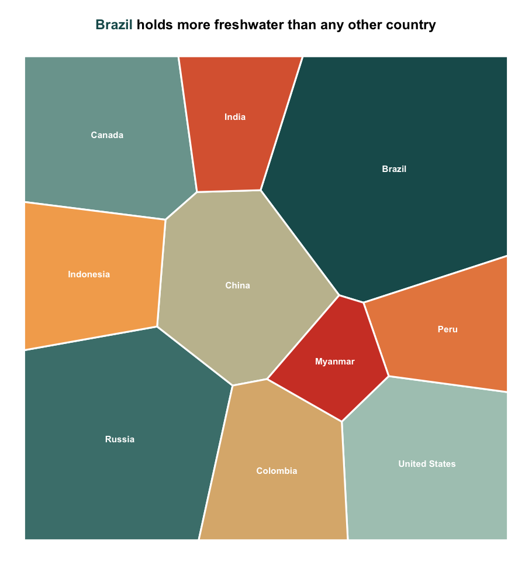

Every text layer accepts a `family =`, so custom fonts (e.g. loaded with
**showtext**) apply directly — no `update_geom_defaults()` workaround:

``` r
library(showtext)
font_add_google("Bitter", "bitter")
showtext_auto()

ggvmap(top10$share, labels = top10$country, palette = "olga",
       family = "bitter", seed = 42) |>
  vm_add_labels(fmt = \(v) paste0(v, "%"), family = "bitter")
```


### `vm_girafe()` — interactive maps

**What it’s for:** hover highlighting and tooltips in HTML output (R
Markdown, Shiny, pkgdown) via **ggiraph**. Build the plot with
`ggvmap(interactive = TRUE)`, then render the widget with `vm_girafe()`
(key arguments: `width_svg`/`height_svg` in inches, `hover_css` for the
highlight style):

``` r
ggvmap(vm, interactive = TRUE, palette = "alger") |> vm_girafe()
```


[Open the animated GIF](man/figures/README-interactive.gif) if it does
not play in your README viewer.

Live version (hover it yourself) in the [Interactive
article](https://loukesio.github.io/ggvmap/articles/interactive.html).

### `vm_as_df()` and `vm_centroids()` — take the data with you

**What they’re for:** escaping the helpers entirely. `vm_as_df()`
returns the tessellation as a tidy data frame (one row per polygon
vertex, with cell label, group, weight, and area), and `vm_centroids()`
one row per cell centre — both ready for hand-rolled `geom_polygon()` /
`geom_text()` layers when you need something the `vm_*` verbs don’t do:

``` r
df <- vm_as_df(vm)
head(df)
vm_centroids(vm)
```

## Saving your map

Two independent knobs control a saved PNG, and confusing them is the \#1
source of “why are my letters tiny / why is everything overlapping”:

- **`width`/`height` in pixels** = how big (and how sharp) the image is.
- **`dpi`** = how big the *letters* are relative to the map. More dpi =
  bigger text, same pixels.

``` r
ggsave("map.png", p, width = 2600, height = 2600, units = "px",
       dpi = 350, bg = "white")
```

Rules of thumb:

- **Square canvas for circular maps** — on a wide rectangle the circle
  is limited by the height and the rest is wasted margin.
- Letters too small → raise `dpi` a notch (350 → 400). Labels
  overlapping → lower it. The pixel size never changes.
- `bg = "white"` — otherwise the PNG is transparent, which some viewers
  display as black.
- For print/journals, save a vector format instead — `ggsave("map.pdf")`
  — which has no resolution at all.

## How it works

Think of a **room full of balloons**, one per value. Every round, each
balloon drifts toward the middle of the space it currently holds, then
inflates a little if its space is too small or deflates if it is too
large. After enough rounds every balloon holds roughly its share of the
room, and the package tells you how close “roughly” is.

Technically, the cells form a **power diagram**: each point of the map
belongs to the centre with the smallest squared distance minus that
centre’s weight. Its borders are straight lines, so every cell is a
convex polygon. The method that adjusts positions and weights is from:

> Nocaj, A. & Brandes, U. (2012). “Computing Voronoi Treemaps — Faster,
> Simpler, and Resolution-independent.” *Computer Graphics Forum*,
> 31(3), 855–864. <doi:10.1111/j.1467-8659.2012.03078.x>

The step sizes, damping and safeguards in each round are ported from
Franck Lebeau’s JavaScript library
[d3-voronoi-map](https://github.com/Kcnarf/d3-voronoi-map) (BSD-3
licence; see `inst/COPYRIGHTS`). When those rounds stall (typically when
one value dominates), the sites are held fixed and the weights are
solved for directly with a damped Newton method (Kitagawa, Mérigot &
Thibert 2019), which fits such maps in a few steps.

## How accurate is it?

Two different questions:

1.  **Are the cells a proper map?** Yes, by construction: every cell is
    cut from the boundary by straight lines, so cells never overlap,
    leave no gaps and are always convex. Tests check this as a safeguard
    against bugs.
2.  **Does each cell get the right area?** Only approximately. The fit
    stops when the cells’ area mistakes (too big or too small), added
    up, come to at most `convergence_ratio` (default 1%) of the map.
    Check it before you publish:

``` r
vm <- voronoi_map(freshwater$share, labels = freshwater$country,
                  group = freshwater$region, clip = clip_circle(), seed = 5)
vm$converged   # TRUE when the whole map is within 1%
vm_fit(vm)     # one row per cell: intended share, drawn share, error
```

Small cells can be off by a large *fraction* of their own size while the
map as a whole is within 1%. Values below 1% of the largest value are
drawn at that floor (`min_weight_ratio`); set it to `0` to keep every
area strictly proportional. The [accuracy
article](https://loukesio.github.io/ggvmap/articles/validation.html)
measures all of this across many sizes, shapes and seeds.

For `vmap_region()`, cells are cut to the supplied outline and can have
inward bends, holes, or separate pieces. Independent geometry tests
check areas, coverage, overlaps, and interior label positions; see
`tests/testthat/test-region.R`. The recorded four-city checks contain 24
successful fits. These checks support the tested cases, not every
possible input.

## Example gallery

More worked examples (with code) live in
[`examples/`](https://github.com/loukesio/ggvmap/tree/main/examples/) —
grouped layouts, custom rings, flags on different shapes, and a combined
infographic.

## Fit values inside real outlines

`vmap_region()` fits positive values inside a supplied outline,
including inward bends, holes, and separate islands. Cell areas
approximate the requested shares. Their positions are arranged by the
algorithm and have no geographic meaning.

Install the current GitHub version and the optional geometry packages:

``` r
remotes::install_github("loukesio/ggvmap")
install.packages(c("polyclip", "sf"))
```

Use the bundled Berlin outline with **invented teaching values**:

``` r
library(ggvmap)
library(sf)

cities <- st_read(
  system.file("extdata", "region-cities.geojson", package = "ggvmap"),
  quiet = TRUE
)
vm <- vmap_region(
  c(30, 25, 18, 12, 8, 5, 2), cities[cities$city == "Berlin", ],
  labels = LETTERS[1:7], crs = 25833, seed = 11
)
stopifnot(vm$converged)
ggvmap(vm, palette = "alger")
```

`crs = 25833` converts Berlin’s coordinates to a local map measured in
meters. Choose a suitable projection for your own region. Coordinate
matrices are also accepted. Several features in one `sf` object are
combined into one outline; fit districts separately to preserve their
individual boundaries.

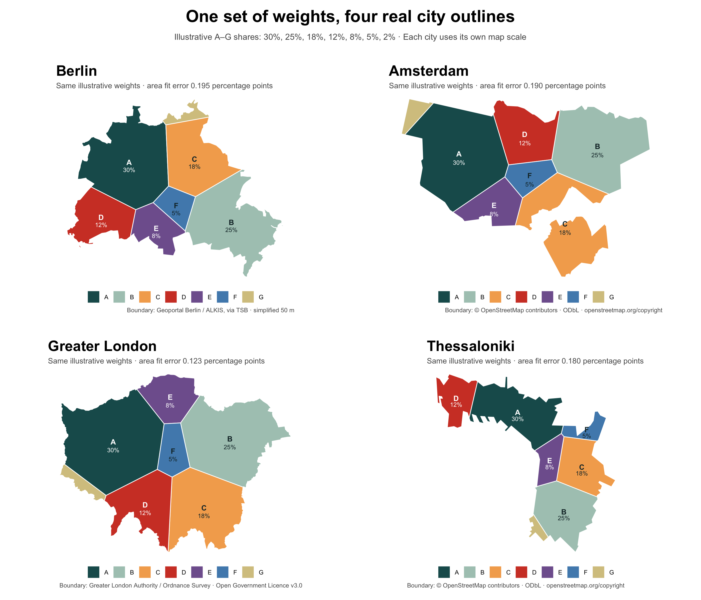

[Open the four-city gallery](examples/region_cities.png) if the image
does not display in your README viewer.

**How to read this gallery:** there are no numeric axes. Read left to
right, then the next row. Each panel is a real city outline; colors
identify the invented categories A–G in the legend, and white lines
separate their cells. The target shares are A = 30%, B = 25%, C = 18%, D
= 12%, E = 8%, F = 5%, and G = 2%. For example, A occupies approximately
30% of each outline; this is not a measured city statistic. Larger cells
mean larger shares, not better outcomes. Cities use different display
scales, so their drawn sizes cannot be compared. The subtitle’s area-fit
error adds all differences between drawn and requested shares, in
percentage points; smaller means closer to the targets, with zero
meaning an exact match. It is not statistical uncertainty. Cell
positions do not show where people or observations are located.

**Limits:** a category may occupy separate pieces. Always check
`vm$converged`; difficult outlines can fail to reach the requested
accuracy. Grouping, interactive display, and decorative outer rings are
not yet supported for region maps.

[Berlin election walkthrough and comparison
charts](https://loukesio.github.io/ggvmap/articles/berlin-vote-shares.html)
· [Rebuild the four-city gallery](examples/region_cities.R) · [24
recorded geometry checks](examples/region_cities_checks.csv) · [Boundary
sources and
licences](https://github.com/loukesio/ggvmap/blob/main/inst/extdata/region-cities.README.md).

## API reference

| Function | Purpose |
|----|----|
| `vmap_region()` | Fit coordinate rings or projected `sf` boundaries, including concavities, holes and separate pieces; needs optional `polyclip` |
| `voronoi_map()` | Core computation (add `group =` for a hierarchical layout); print it to check convergence |
| `ggvmap()` | The main ggplot2 visualisation (`autoscale`, `min_area`, `wrap`, per-cell `label_size` / `label_col` / `fontface`, `fill_by`, `family`) |
| `autoplot()` | Alias for `ggvmap()` via the ggplot2 generic |
| `plot()` | Base R visualisation |
| `vm_add_ring()` | Outer annotation ring: `style = "band"` or `"arc"` (with `values`, `colors`, `label_size`, `offset`) |
| `vm_add_flags()` | Add country flags at cell centroids |
| `vm_add_images()` | Add arbitrary images at cell centroids |
| `vm_add_labels()` | Add value labels (`fmt`, `inside`, `autoscale`, `min_area`, per-cell `size` / `col`) |
| `vm_girafe()` | Render an `interactive = TRUE` plot as a hoverable widget |
| `vm_palettes()` | List the 32 built-in colour palettes |
| `vm_as_df()` / `vm_centroids()` | Tidy data frame / centroids |
| `vm_fit()` | Per-cell check: intended vs drawn share |
| `country_to_iso()` / `flag_url()` / `flag_cache()` | Flag helpers |
| `clip_square()` / `clip_hexagon()` / `clip_circle()` / `clip_diamond()` / `regular_polygon()` | Boundary shapes |

## Comparison with other R packages

| Feature | ggvmap | voronoiTreemap | WeightedTreemaps |
|----|----|----|----|
| Backend | Pure R core; optional compiled geometry for regions | D3.js (htmlwidget) | C++ / CGAL |
| ggplot2 native | ✅ | ❌ | ❌ |
| Required packages | ggplot2; optional polyclip / sf for regions | htmlwidgets, d3 | RcppCGAL |
| Hierarchical | ✅ (grouped) | ✅ | ✅ |
| Annotation ring / flags | ✅ | ❌ | ❌ |
| Custom shapes | ✅ convex; non-convex via optional `polyclip` | ✅ | ✅ |
| Install complexity | Trivial | Medium | Hard (CGAL) |

## Acknowledgements

This package started from the Stack Overflow question [Make a circular
Voronoi diagram in
R](https://stackoverflow.com/questions/71799205/make-a-circular-voronoi-diagram-in-r),
and owes a lot to the inspiration of [Allan
Cameron](https://stackoverflow.com/users/12500315/allan-cameron)’s
answer there — thank you, Allan.

ggvmap pairs naturally with its sibling packages
[ltc](https://github.com/loukesio/ltc-color-palettes) (the colour
palettes) and [ggsynteny](https://github.com/loukesio/ggsynteny)
(synteny plots).

## License

MIT © 2026 Loukas Theodosiou — see [LICENSE.md](LICENSE.md) for the full
text. (The two-line [LICENSE](LICENSE) file is the CRAN-required stub
that points to the same terms.)
