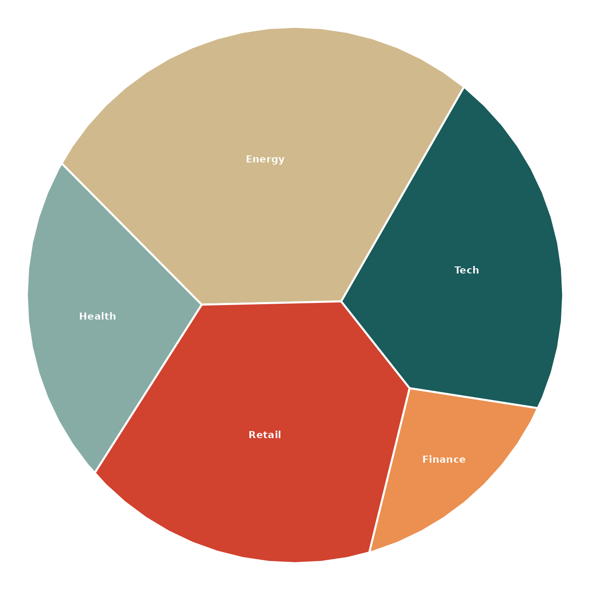
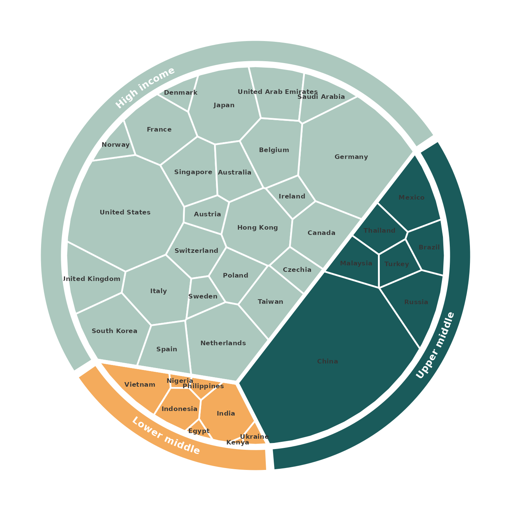

# Grouped layouts, rings and flag annotations

``` r

library(ggvmap)
```

`ggvmap` builds Voronoi *treemaps* — space-filling partitions where each
cell’s area is proportional to a weight. Beyond the flat map, three
features let you reproduce publication-style infographics:

1.  **Hierarchical (grouped) layouts** — cells organised into sectors by
    group.
2.  **An outer annotation ring** — a labelled coloured band wrapping the
    map.
3.  **Flag / image / value annotations** — pictures and numbers on each
    cell.

## A flat map

``` r

vm <- voronoi_map(
  weights = c(30, 20, 50, 10, 40),
  labels  = c("Tech", "Health", "Energy", "Finance", "Retail"),
  clip    = clip_circle(),
  seed    = 42
)
ggvmap(vm, palette = "alger")
```



(`palette = "alger"` is a built-in four-colour palette; the default is
the colourblind-safe Okabe–Ito palette.)

## Hierarchical layouts and the outer ring

Pass a `group` vector and
[`voronoi_map()`](https://loukesio.github.io/ggvmap/reference/voronoi_map.md)
first divides the disk into one sector per group (area ∝ the group’s
total weight), then fills each sector with its members.
[`vm_add_ring()`](https://loukesio.github.io/ggvmap/reference/vm_add_ring.md)
wraps the result in a colour-coded, labelled ring whose segments line up
with the sectors — the world-exports infographic style.

``` r

data(world_exports)

vm <- voronoi_map(
  weights = world_exports$exports,
  labels  = world_exports$country,
  group   = as.character(world_exports$income_group),
  clip    = clip_circle(),
  seed    = 1,
  max_iter = 80
)

ggvmap(vm, label_size = 2.3, label_col = "grey20", palette = "alger") |>
  vm_add_ring(width = 0.11, label_size = 3.4, palette = "alger")
```



The annotation helpers use the `|>` pipe: each reads the underlying map
from the plot and returns a new plot, so they chain naturally.

## Flags and value labels

[`vm_add_flags()`](https://loukesio.github.io/ggvmap/reference/vm_add_flags.md)
resolves country names (English or German) to national flags — by
default via
[`ggimage::geom_flag()`](https://rdrr.io/pkg/ggimage/man/geom_flag.html)
(`method = "geom_flag"`), or from [flagcdn.com](https://flagcdn.com)
with `method = "url"` (which also supports an offline `cache = TRUE`).
[`vm_add_labels()`](https://loukesio.github.io/ggvmap/reference/vm_add_labels.md)
prints a value under each name — the merchant-fleet infographic style.
(These examples need an internet connection and the **ggimage** package,
so they are not evaluated here.)

``` r

data(merchant_fleet)

vm <- voronoi_map(
  weights = merchant_fleet$owned,
  labels  = merchant_fleet$country,
  clip    = clip_square(),
  seed    = 3
)

ggvmap(vm, label_size = 3.2, label_col = "grey15", palette = "alger") |>
  vm_add_labels(
    value = stats::setNames(merchant_fleet$owned, merchant_fleet$country),
    size  = 2.6, nudge_y = -0.035
  ) |>
  vm_add_flags(size = 0.05, nudge_y = 0.05)
```

For offline rendering, pre-download the flags once:

``` r

iso   <- country_to_iso(merchant_fleet$country)
files <- flag_cache(iso, dir = "flags")          # writes flags/<iso>.png
```

[`vm_add_images()`](https://loukesio.github.io/ggvmap/reference/vm_add_images.md)
is the generic version — pass any vector of image paths or URLs (logos,
icons, photos) instead of flags.

## Interactive maps

Set `interactive = TRUE` to make the cells hoverable (highlight +
tooltip) via [ggiraph](https://davidgohel.github.io/ggiraph/), then
render the widget with
[`vm_girafe()`](https://loukesio.github.io/ggvmap/reference/vm_girafe.md).
It works in R Markdown / Quarto, Shiny and the RStudio viewer. **Hover
the cells below** — this one is live:

``` r

vm <- voronoi_map(
  weights = c(30, 20, 50, 10, 40, 15, 25),
  labels  = c("Tech", "Health", "Energy", "Finance", "Retail", "Media", "Auto"),
  clip    = clip_circle(), seed = 42
)

ggvmap(vm, interactive = TRUE) |>
  vm_girafe(width_svg = 6, height_svg = 6)
```

Pass `tooltip =` for custom hover text (length-`n`, named by label, or
length 1):

``` r

ggvmap(vm, interactive = TRUE,
         tooltip = paste0(vm$sites$label, ": ", vm$sites$data_weight, "% share")) |>
  vm_girafe()
```
