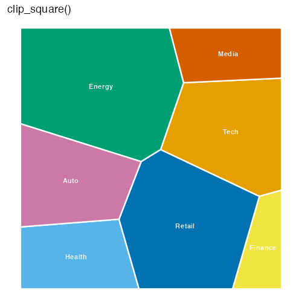
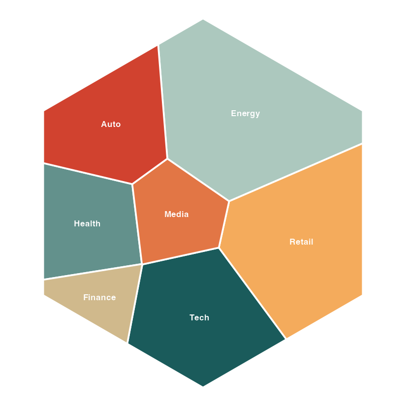
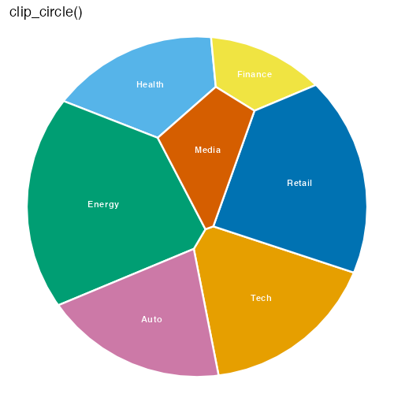
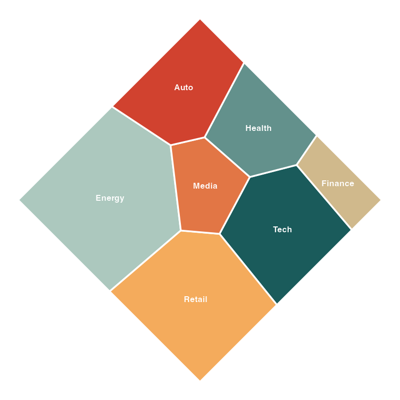
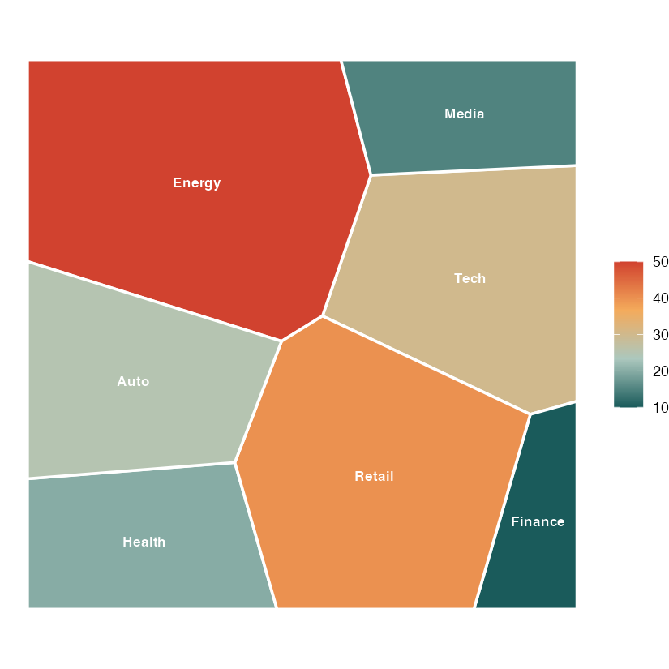
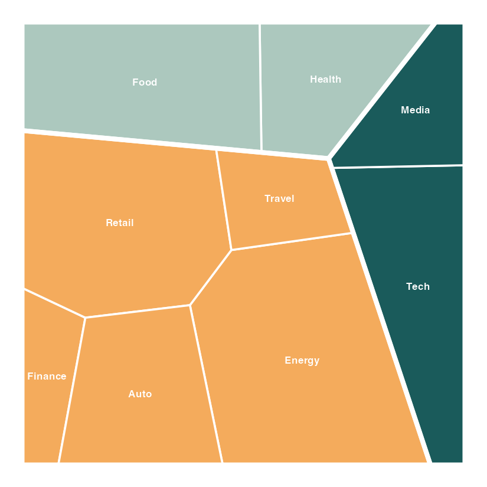
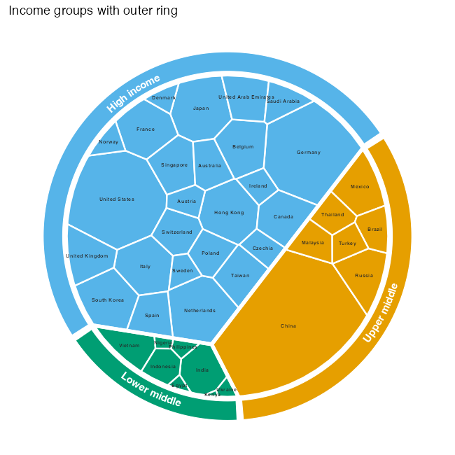
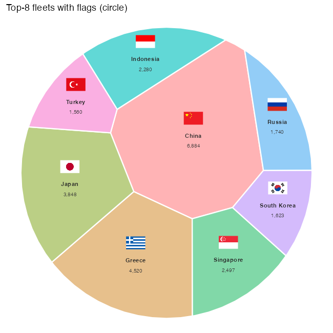
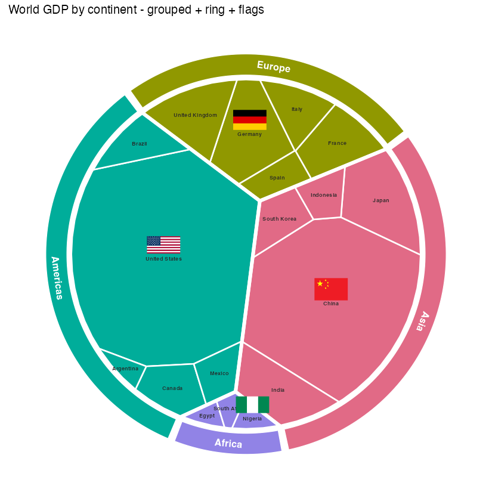

# ggvmap example gallery

Rendered with `ggvmap`. Reproduce any of them with the package loaded
(`devtools::load_all(".")`).

### Boundary shapes

The same 7 weights on four convex boundaries.

| | |
|---|---|
|  |  |
|  |  |

### Fill by value

`autoplot(fill_by = "data_weight")` with an Okabe-Ito ramp.



### Hierarchical (grouped) layout

Groups laid out in their own sub-regions — a nested treemap.



### Outer annotation ring

World exports grouped by income, with a labelled outer ring (curved labels).



### Flags + value labels

Top-8 merchant fleets, flags via `ggimage::geom_flag()` + value labels.



### Everything combined

Grouped sectors + ring + flags in one plot.



### Interactive

`interactive_demo.html` is a **live** hoverable map (open it in a browser —
HTML/JS doesn't render in GitHub's markdown preview). See the live version in the
[Annotations article](https://loukesio.github.io/ggvmap/articles/annotations.html#interactive-maps).

```r
vm <- voronoi_map(c(30,20,50,10,40,15,25),
                  labels = c("Tech","Health","Energy","Finance","Retail","Media","Auto"),
                  clip = clip_circle(), seed = 42)
autoplot(vm, interactive = TRUE) |> vm_girafe()
```
