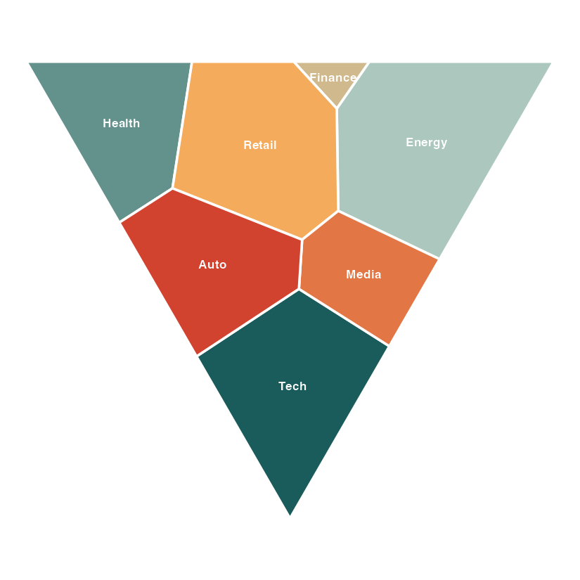
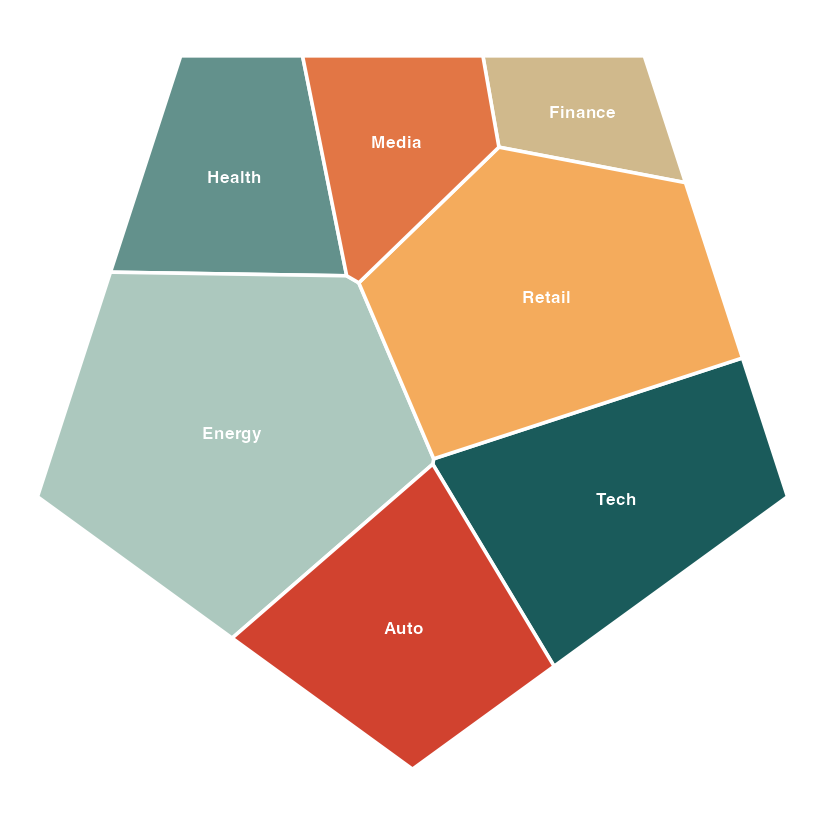
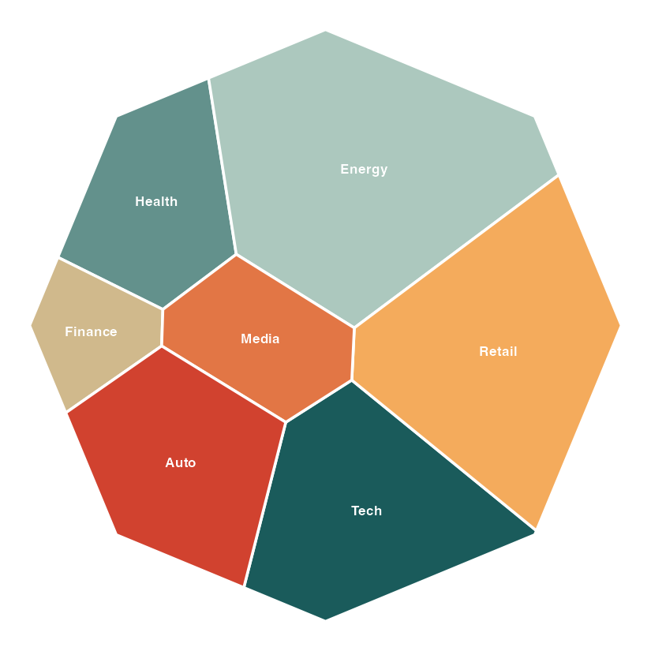
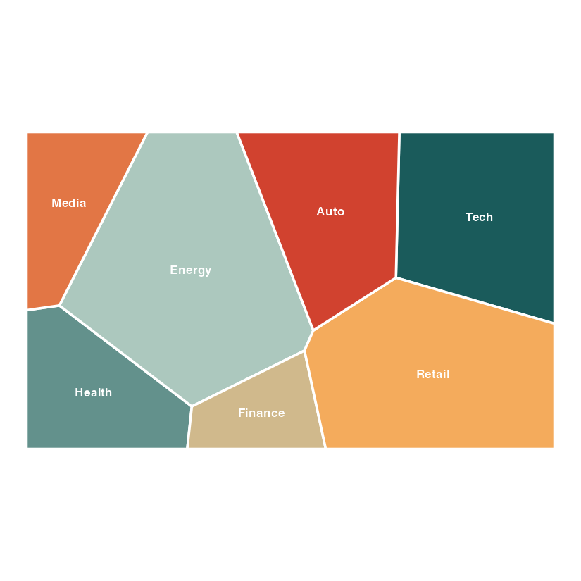
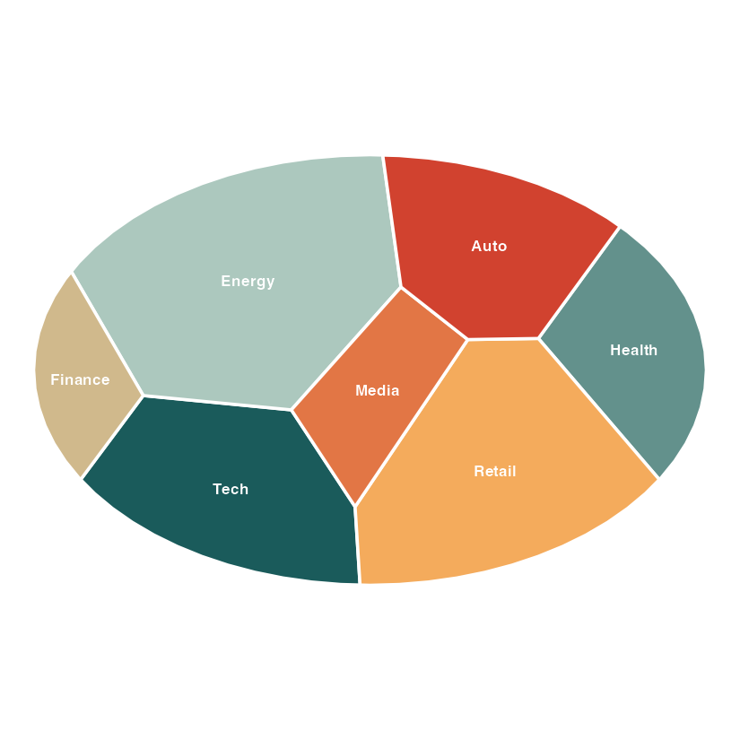
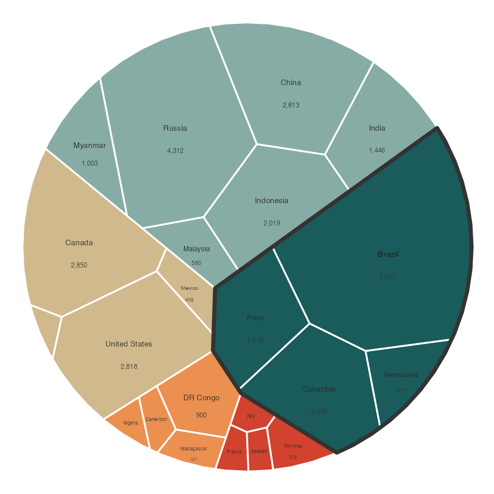

# ggvmap example gallery

Rendered with `ggvmap` using the built-in `"alger"` palette. Regenerate every
figure with `Rscript examples/make_gallery.R` from the package root.

### Boundary shapes

The same 7 weights on any convex boundary — `clip_square()`, `clip_hexagon()`,
`clip_circle()`, `clip_diamond()`, `clip_triangle()`, `clip_pentagon()`,
`clip_octagon()`, `clip_rectangle()`, `clip_ellipse()`, or any
`regular_polygon(n)`.

| | | |
|---|---|---|
|  |  |  |
|  |  |  |
|  |  |  |

### Fill by value

`ggvmap(vm, fill_by = "data_weight", palette = "alger")` — a continuous ramp.


### Hierarchical (grouped) layout

Groups laid out in their own sub-regions — a nested treemap.


### Outer annotation ring

World exports grouped by income, with a labelled outer ring (curved labels).


### Flags + value labels

Top-8 merchant fleets, flags via `ggimage::geom_flag()` + value labels.


### Everything combined

Grouped sectors + ring + flags in one plot.


### Small-cell handling

World freshwater resources by region: `autoscale = TRUE` shrinks labels in
tiny cells, `min_area` hides them entirely below a threshold,
`group_border_col = c("South America" = "#333333")` outlines one region, and
`fontface = c(Brazil = "bold.italic")` styles a single cell.



### Interactive

`interactive_demo.html` is a **live** hoverable map (open it in a browser —
HTML/JS doesn't render in GitHub's markdown preview). See the live version in the
[Annotations article](https://loukesio.github.io/ggvmap/articles/annotations.html#interactive-maps).

```r
vm <- voronoi_map(c(30,20,50,10,40,15,25),
                  labels = c("Tech","Health","Energy","Finance","Retail","Media","Auto"),
                  clip = clip_circle(), seed = 42)
ggvmap(vm, interactive = TRUE) |> vm_girafe()
```
