# ggvmap

> Voronoi Map Treemaps for ggplot2

**ggvmap** partitions a convex polygon into cells whose areas are
proportional to data weights — a *Voronoi treemap*. It implements the
Nocaj & Brandes (2012) iterative power-diagram algorithm in **pure R**
(no compiled code, no CGAL, no JavaScript) with first-class **ggplot2**
integration: hierarchical (grouped) layouts, annotation rings, flags,
value labels, and interactive hover maps.

## Installation

ggvmap is pure R with a single hard dependency (ggplot2) — no
compilation, no system libraries. Install the latest version from
GitHub:

``` r

# with remotes (lightweight)
install.packages("remotes")
remotes::install_github("loukesio/ggvmap")

# ...or with devtools
devtools::install_github("loukesio/ggvmap")
```

To install a specific release, append its tag:

``` r

remotes::install_github("loukesio/ggvmap@v0.3.0")
```

Some features use optional packages — install the ones you need:

``` r

install.packages(c(
  "ggimage",       # vm_add_flags(), vm_add_images()
  "ggiraph",       # interactive = TRUE + vm_girafe()
  "geomtextpath",  # curved ring labels
  "ggtext",        # markdown titles
  "showtext"       # custom fonts
))
```

Then load it like any package:

``` r

library(ggvmap)
```

## The one-glance demo

Everything below is drawn from one bundled dataset — `data(freshwater)`,
each country’s share of global renewable freshwater (FAO Aquastat via
World Bank, 2022):

``` r

library(ggvmap)
data(freshwater)

vm <- voronoi_map(freshwater$share, labels = freshwater$country,
                  group = freshwater$region, clip = clip_circle(),
                  seed = 5, max_iter = 80)

ggvmap(vm, palette = "alger", autoscale = TRUE, min_area = 0.004,
       label_col = c(Brazil = "grey95"), fontface = c(Brazil = "bold")) |>
  vm_add_labels(fmt = \(v) paste0(v, "%"), autoscale = TRUE) |>
  vm_add_ring(style = "arc", palette = "alger", values = TRUE)
```

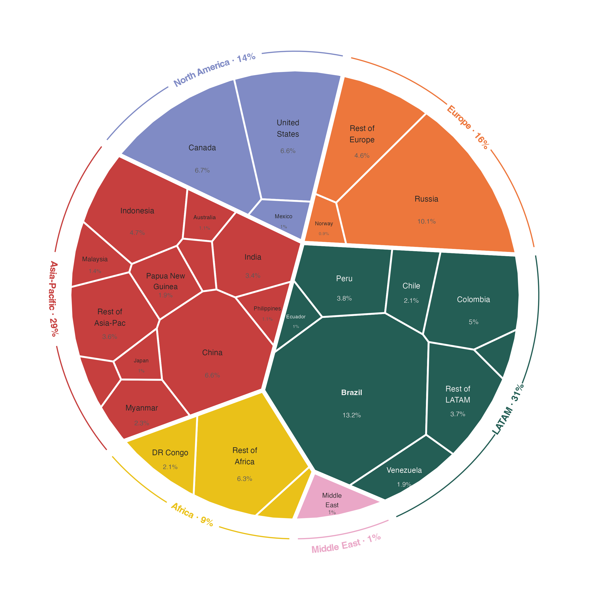

The full script is
[`examples/freshwater_tour.R`](https://loukesio.github.io/ggvmap/examples/freshwater_tour.R).

## Quick start

[`ggvmap()`](https://loukesio.github.io/ggvmap/reference/ggvmap.md)
computes *and* plots in one call — give it weights, or a precomputed
`voronoi_map` object:

``` r

library(ggvmap)
data(freshwater)

top10 <- freshwater[!grepl("^Rest of|Middle East", freshwater$country), ][1:10, ]

ggvmap(top10$share, labels = top10$country, palette = "alger", seed = 42)
```

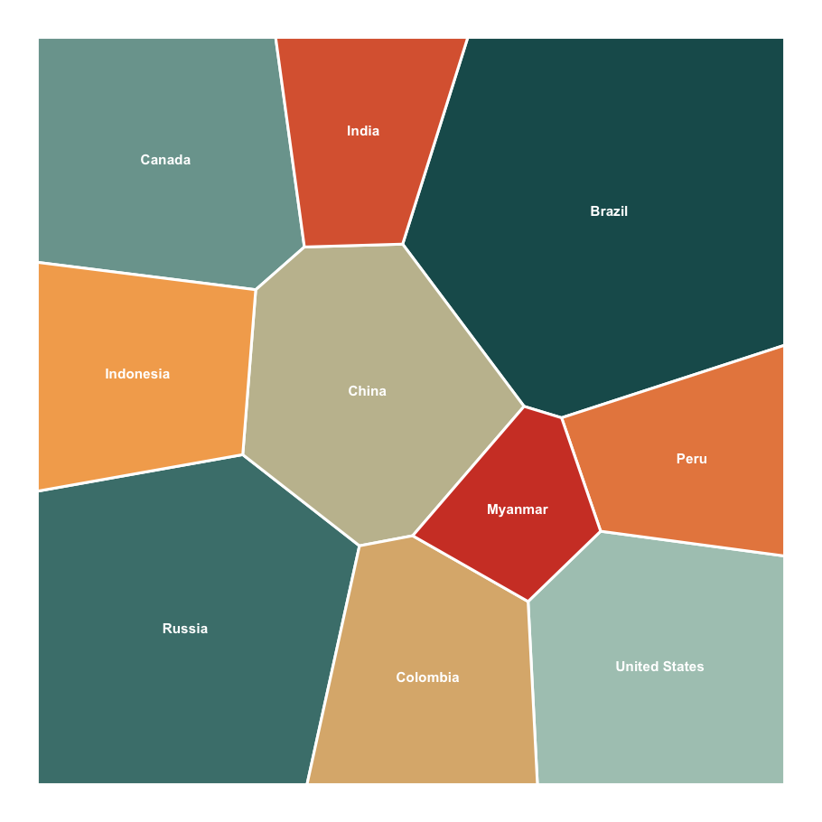

## Feature tour

### Any convex boundary

The same data on
[`clip_square()`](https://loukesio.github.io/ggvmap/reference/clip_shapes.md),
[`clip_hexagon()`](https://loukesio.github.io/ggvmap/reference/clip_shapes.md),
[`clip_circle()`](https://loukesio.github.io/ggvmap/reference/clip_shapes.md),
[`clip_diamond()`](https://loukesio.github.io/ggvmap/reference/clip_shapes.md),
[`clip_triangle()`](https://loukesio.github.io/ggvmap/reference/clip_shapes.md),
[`clip_pentagon()`](https://loukesio.github.io/ggvmap/reference/clip_shapes.md),
[`clip_octagon()`](https://loukesio.github.io/ggvmap/reference/clip_shapes.md),
[`clip_rectangle()`](https://loukesio.github.io/ggvmap/reference/clip_rectangle.md),
[`clip_ellipse()`](https://loukesio.github.io/ggvmap/reference/clip_ellipse.md)
— or any `regular_polygon(n)`:

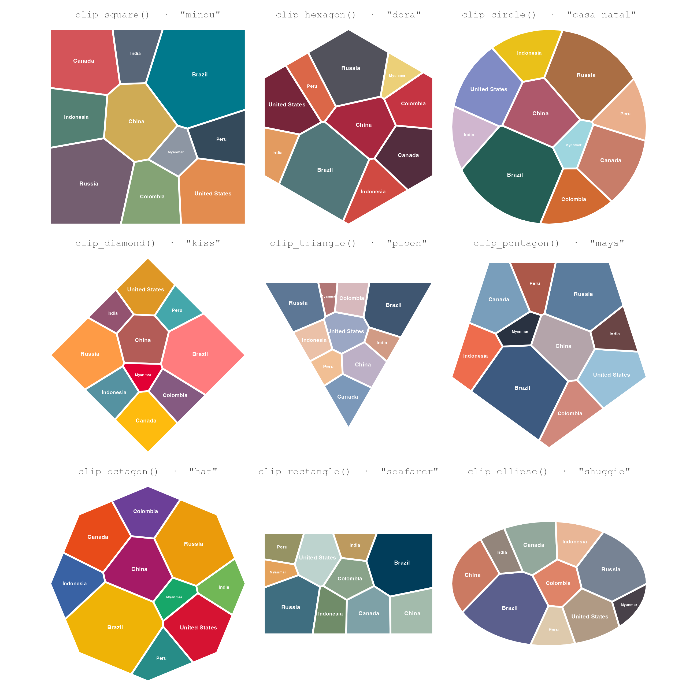

### Small cells: autoscale and min_area

Real part-of-whole data has a long tail of sub-1% cells.
`autoscale = TRUE` shrinks their labels (floored at 60% of
`label_size`), and `min_area` hides labels below an area threshold:

``` r

vm <- voronoi_map(freshwater$share, labels = freshwater$country,
                  group = freshwater$region, clip = clip_circle(),
                  seed = 5, max_iter = 80)

ggvmap(vm, palette = "alger", label_col = "grey15",
       autoscale = TRUE, min_area = 0.004)
```

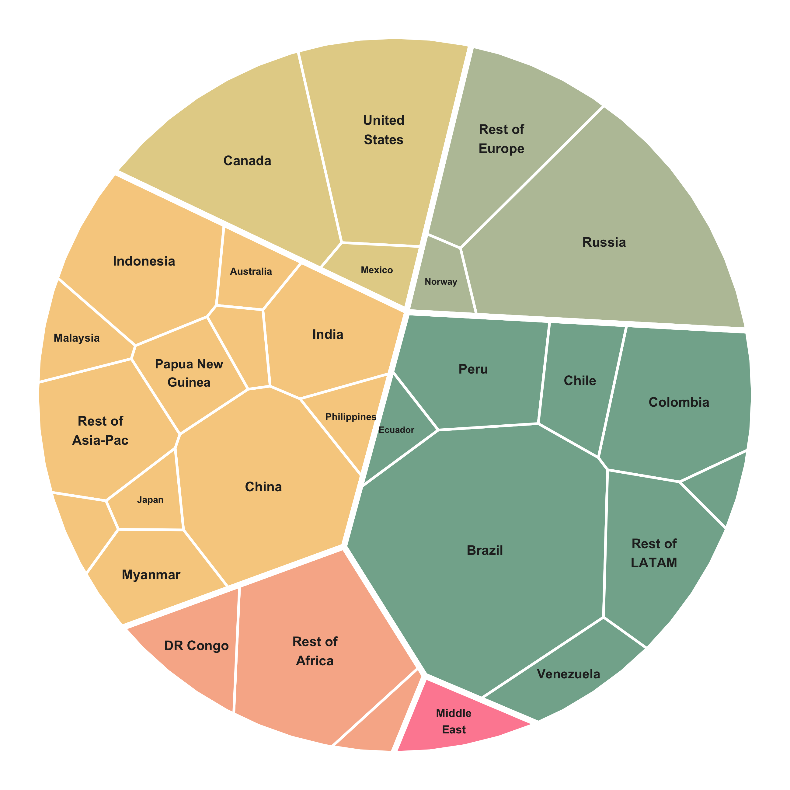

### Emphasis: single cells and single groups

`fontface`, `label_col` and `group_border_col` accept vectors *named by
cell or group*, and `label_cells` / `cells` restrict which cells get
labels at all:

``` r

ggvmap(vm, palette = "alger",
       label_cells      = c("Brazil", "Russia", "Canada"),
       label_col        = c(Brazil = "grey95", Russia = "grey15",
                            Canada = "grey15"),
       fontface         = c(Brazil = "bold.italic"),
       group_border_col = c(LATAM = "#333333")) |>
  vm_add_labels(fmt = \(v) paste0(v, "%"),
                cells = c("Brazil", "Russia", "Canada"),
                col   = c(Brazil = "grey85"))
```

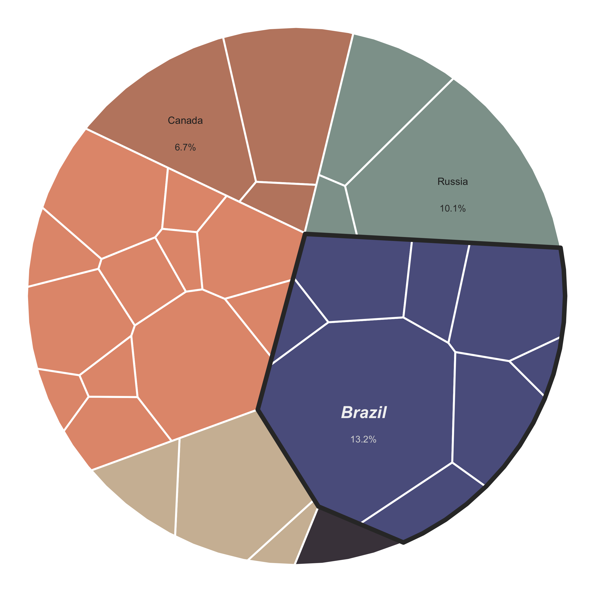

### Continuous fill

``` r

ggvmap(vm, fill_by = "data_weight", palette = "alger",
       label_col = "grey15", autoscale = TRUE, min_area = 0.006,
       legend = TRUE)
```

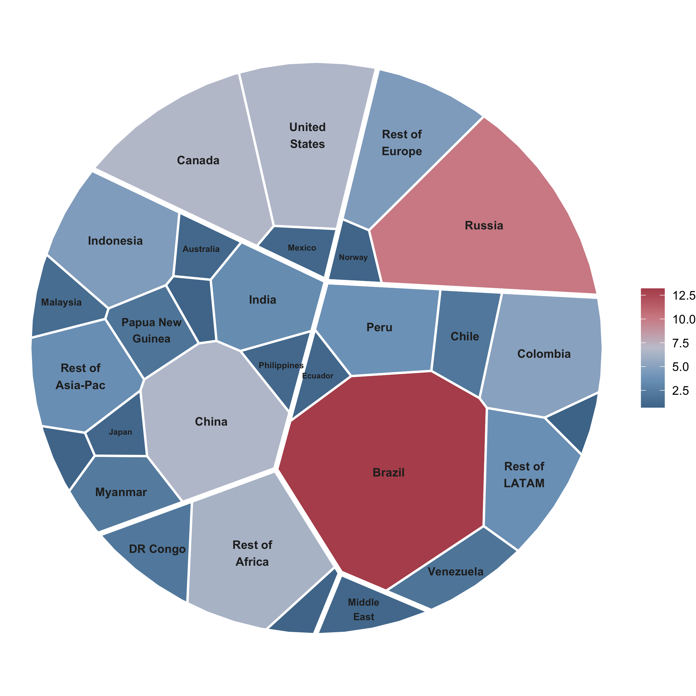

### Ring styles: band and arc

[`vm_add_ring()`](https://loukesio.github.io/ggvmap/reference/vm_add_ring.md)
wraps a circular map in a group-aligned annotation ring: the filled
`"band"` (default), or the thin `"arc"` with the group label —
optionally with its share (`values = TRUE`) — sitting in a gap broken
into the line:

``` r

ggvmap(vm, palette = "alger", label_col = "grey15",
       autoscale = TRUE, min_area = 0.004) |>
  vm_add_ring(style = "band", palette = "alger", width = 0.11)
```

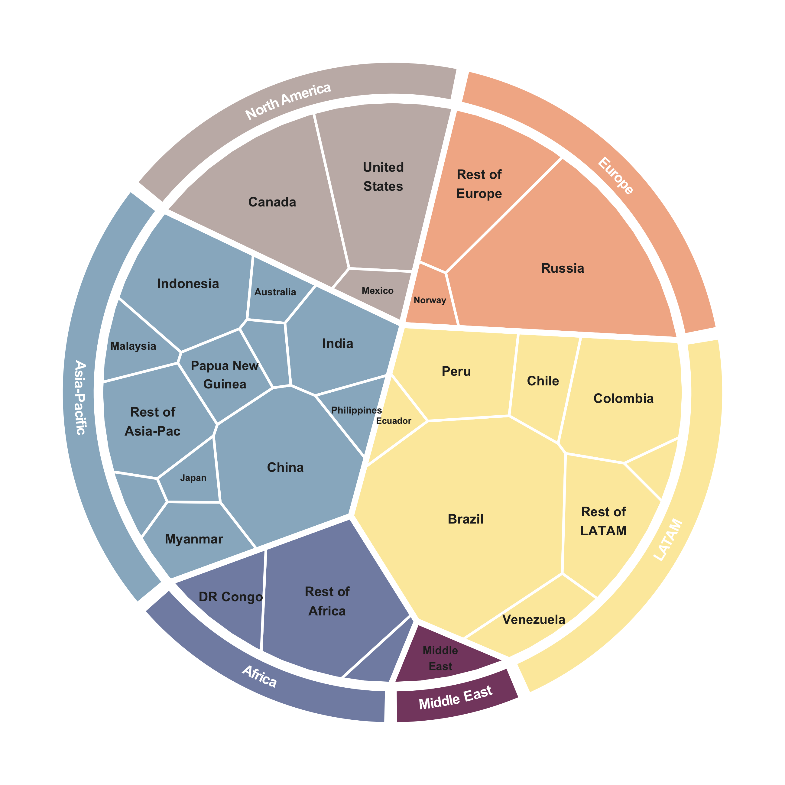

``` r

ggvmap(vm, palette = "alger", label_col = "grey15",
       autoscale = TRUE, min_area = 0.004) |>
  vm_add_ring(style = "arc", palette = "alger", values = TRUE)
```

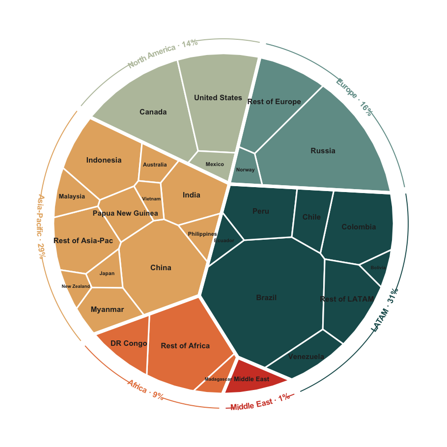

The arcs follow the group colours by default; `colors =` overrides them
— one colour for all arcs (e.g. `colors = "#333333"` for a uniform dark
ring), or a vector named by group for full control:

``` r

ggvmap(vm, palette = "alger", label_col = "grey15",
       autoscale = TRUE, min_area = 0.004) |>
  vm_add_ring(style = "arc", colors = "#333333", values = TRUE)
```

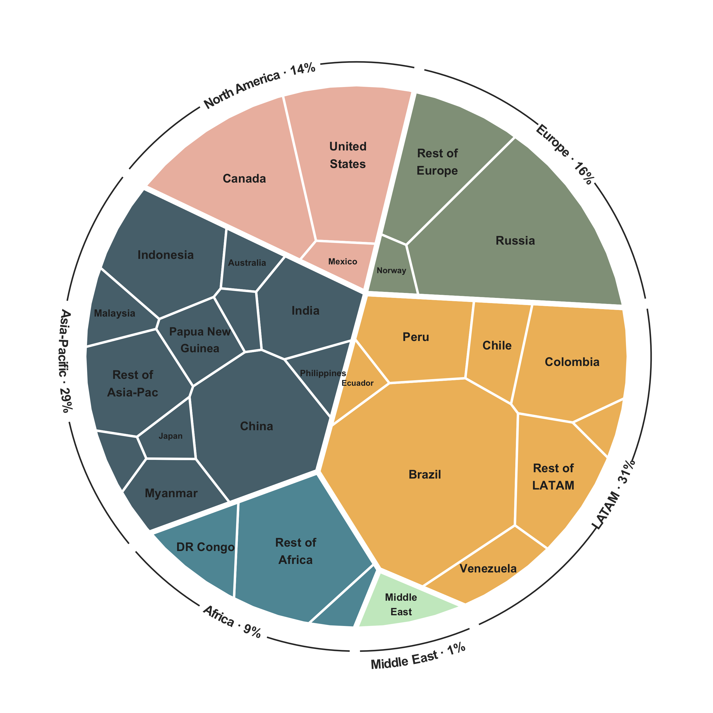

### Flags

[`vm_add_flags()`](https://loukesio.github.io/ggvmap/reference/vm_add_flags.md)
resolves country names (English or German) to national flags via the
**ggimage** package:

``` r

ggvmap(top10$share, labels = top10$country, clip = clip_circle(),
       palette = "alger", label_col = "grey15", seed = 42) |>
  vm_add_labels(fmt = \(v) paste0(v, "%")) |>
  vm_add_flags(size = 0.05, nudge_y = 0.055)
```

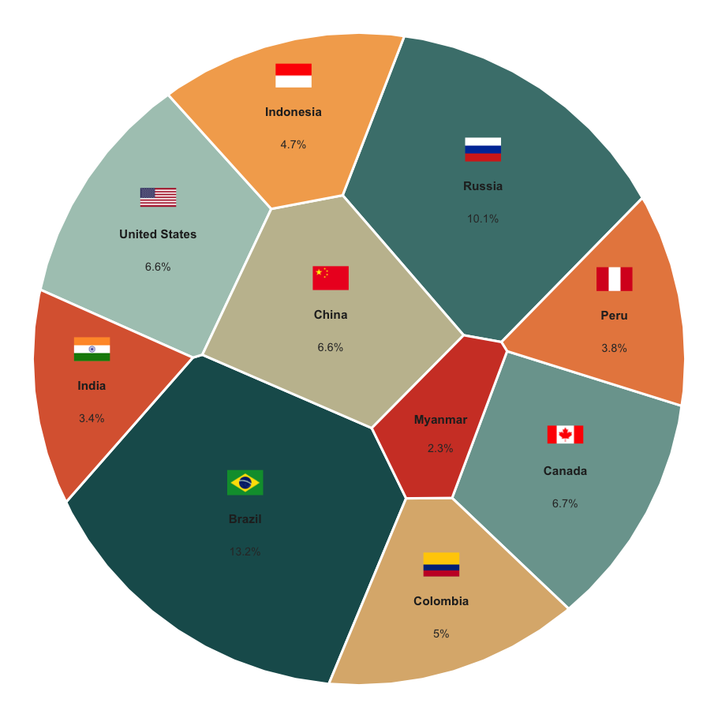

### Titles and fonts

A ggvmap plot is a ggplot, so titles work the usual way:

``` r

ggvmap(top10$share, labels = top10$country, palette = "alger", seed = 42) +
  ggplot2::ggtitle("Countries with the most freshwater",
                   subtitle = "Share of global renewable freshwater, 2022") +
  ggplot2::theme(plot.title = ggplot2::element_text(face = "bold", hjust = 0.5),
                 plot.subtitle = ggplot2::element_text(colour = "grey40",
                                                       hjust = 0.5))
```

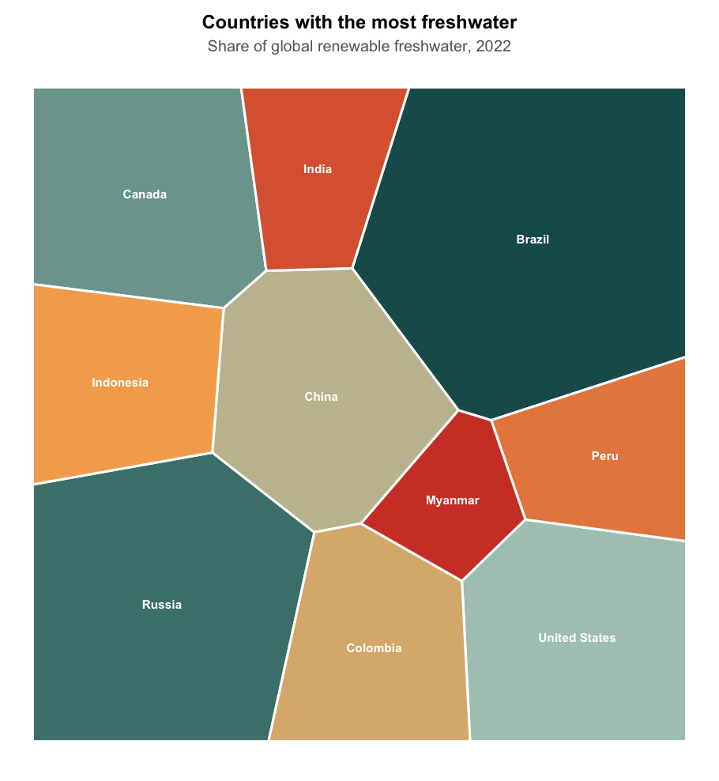

With **ggtext**, titles take markdown — handy for colour-coding words to
the map instead of using a legend:

``` r

library(ggtext)
ggvmap(top10$share, labels = top10$country, palette = "alger", seed = 42) +
  ggplot2::labs(title = paste0(
    "**<span style='color:#1A5B5B;'>Brazil</span> holds more freshwater ",
    "than any other country**")) +
  ggplot2::theme(plot.title = element_markdown(hjust = 0.5, size = 13))
```

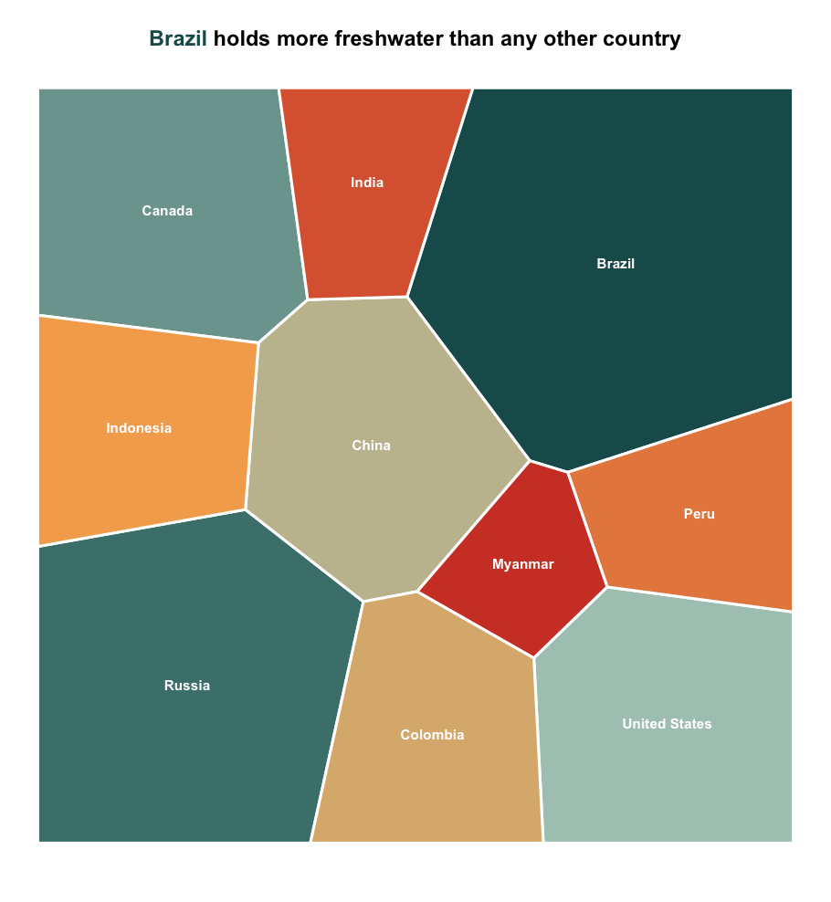

Every text layer accepts a `family =`, so custom fonts (e.g. loaded with
**showtext**) apply directly — no `update_geom_defaults()` workaround:

``` r

library(showtext)
font_add_google("Bitter", "bitter")
showtext_auto()

ggvmap(top10$share, labels = top10$country, palette = "alger",
       family = "bitter", seed = 42) |>
  vm_add_labels(fmt = \(v) paste0(v, "%"), family = "bitter")
```


### Interactive maps

`ggvmap(interactive = TRUE)` makes the cells hoverable (highlight +
tooltip) via **ggiraph**; render the widget with
[`vm_girafe()`](https://loukesio.github.io/ggvmap/reference/vm_girafe.md):

``` r

ggvmap(vm, interactive = TRUE, palette = "alger") |> vm_girafe()
```

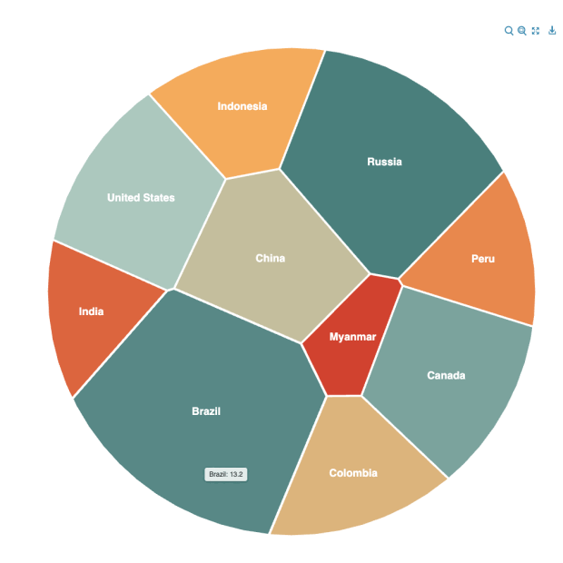

Live version (hover it yourself) in the [Interactive
article](https://loukesio.github.io/ggvmap/articles/interactive.html).

## Step-by-step usage

``` r

# 1. Compute the map
vm <- voronoi_map(
  weights = freshwater$share,
  labels  = freshwater$country,
  clip    = clip_hexagon(),
  seed    = 42
)
print(vm)

# 2. Plot with ggplot2
ggvmap(vm, palette = "alger")

# 3. Or with base R
plot(vm)

# 4. Access the tidy data frame for custom ggplot2
df <- vm_as_df(vm)
head(df)
```

## How it works

The algorithm is like a **room full of balloons**: each balloon wants to
claim space proportional to its importance. Every iteration, each
balloon drifts toward the centre of its current territory (position
adaptation) and inflates or deflates to grab the right amount of area
(weight adaptation). After enough rounds, the room is perfectly
partitioned.

Under the hood, it’s an iterative **power diagram** (weighted Voronoi
tessellation) following:

> Nocaj, A. & Brandes, U. (2012). “Computing Voronoi Treemaps — Faster,
> Simpler, and Resolution-independent.” *Computer Graphics Forum*,
> 31(3), 855–864. <doi:10.1111/j.1467-8659.2012.03078.x>

## Is it correct?

Yes — and it’s verified. The tessellation is an *exact* power diagram
(to floating-point precision): cells satisfy the defining
minimum-power-distance property, tile the domain with no gaps or
overlaps, are all convex, and the hierarchical layout is a valid nested
power diagram. These invariants are enforced by
`tests/testthat/test-correctness.R` and explained in the [Correctness
article](https://loukesio.github.io/ggvmap/articles/validation.html).

## Example gallery

More worked examples (with code) live in
[`examples/`](https://loukesio.github.io/ggvmap/examples/) — grouped
layouts, custom rings, flags on different shapes, and a combined
infographic.

## API reference

| Function | Purpose |
|----|----|
| [`voronoi_map()`](https://loukesio.github.io/ggvmap/reference/voronoi_map.md) | Core computation (add `group =` for a hierarchical layout) |
| [`ggvmap()`](https://loukesio.github.io/ggvmap/reference/ggvmap.md) | The main ggplot2 visualisation (accepts a map or raw weights; `autoscale`, `min_area`, `fontface`, `family`, per-cell `label_col`) |
| [`autoplot()`](https://ggplot2.tidyverse.org/reference/autoplot.html) | Alias for [`ggvmap()`](https://loukesio.github.io/ggvmap/reference/ggvmap.md) via the ggplot2 generic |
| [`plot()`](https://rdrr.io/r/graphics/plot.default.html) | Base R visualisation |
| [`vm_add_ring()`](https://loukesio.github.io/ggvmap/reference/vm_add_ring.md) | Outer annotation ring: `style = "band"` or `"arc"` (with `values`, `linetype`, `offset`) |
| [`vm_add_flags()`](https://loukesio.github.io/ggvmap/reference/vm_add_flags.md) | Add country flags at cell centroids |
| [`vm_add_images()`](https://loukesio.github.io/ggvmap/reference/vm_add_images.md) | Add arbitrary images at cell centroids |
| [`vm_add_labels()`](https://loukesio.github.io/ggvmap/reference/vm_add_labels.md) | Add value labels (`inside`, `autoscale`, `min_area`, per-cell `col`) |
| [`vm_girafe()`](https://loukesio.github.io/ggvmap/reference/vm_girafe.md) | Render an `interactive = TRUE` plot as a hoverable widget |
| [`vm_as_df()`](https://loukesio.github.io/ggvmap/reference/vm_as_df.md) / [`vm_centroids()`](https://loukesio.github.io/ggvmap/reference/vm_centroids.md) | Tidy data frame / centroids |
| [`country_to_iso()`](https://loukesio.github.io/ggvmap/reference/country_to_iso.md) / [`flag_url()`](https://loukesio.github.io/ggvmap/reference/flag_url.md) / [`flag_cache()`](https://loukesio.github.io/ggvmap/reference/flag_cache.md) | Flag helpers |
| [`clip_square()`](https://loukesio.github.io/ggvmap/reference/clip_shapes.md) / [`clip_hexagon()`](https://loukesio.github.io/ggvmap/reference/clip_shapes.md) / [`clip_circle()`](https://loukesio.github.io/ggvmap/reference/clip_shapes.md) / [`clip_diamond()`](https://loukesio.github.io/ggvmap/reference/clip_shapes.md) / [`regular_polygon()`](https://loukesio.github.io/ggvmap/reference/regular_polygon.md) | Boundary shapes |

## Comparison with other R packages

| Feature                 | ggvmap        | voronoiTreemap     | WeightedTreemaps |
|-------------------------|---------------|--------------------|------------------|
| Backend                 | Pure R        | D3.js (htmlwidget) | C++ / CGAL       |
| ggplot2 native          | ✅            | ❌                 | ❌               |
| Dependencies            | ggplot2 only  | htmlwidgets, d3    | RcppCGAL         |
| Hierarchical            | ✅ (grouped)  | ✅                 | ✅               |
| Annotation ring / flags | ✅            | ❌                 | ❌               |
| Custom shapes           | ✅ any convex | ✅                 | ✅               |
| Install complexity      | Trivial       | Medium             | Hard (CGAL)      |

## License

MIT
