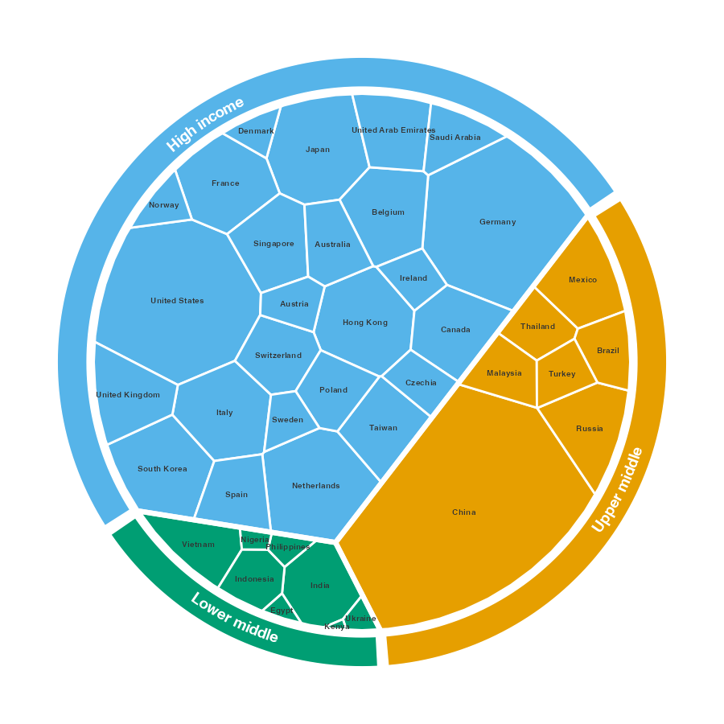
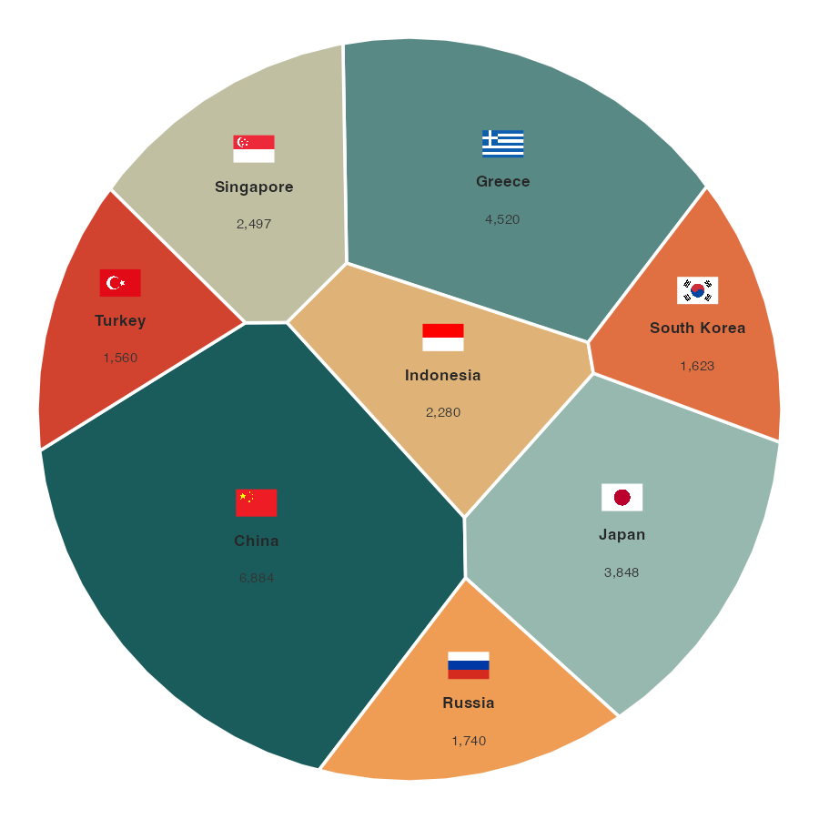

# ggvmap

> Voronoi Map Treemaps for ggplot2

**ggvmap** partitions a convex polygon into cells whose areas are
proportional to data weights — a *Voronoi treemap*. It implements the
Nocaj & Brandes (2012) iterative power-diagram algorithm in **pure R**
(no compiled code, no CGAL, no JavaScript) with first-class **ggplot2**
integration.

It supports **hierarchical (grouped) layouts**, a decorative **outer
annotation ring**, and **flag / image / value annotations** — enough to
reproduce publication-style Voronoi-treemap infographics.

## Installation

``` r

# From GitHub
devtools::install_github("loukesio/ggvmap")
```

## Quick start

``` r

library(ggvmap)

# One-liner: compute + plot
ggvmap(
  weights = c(30, 20, 50, 10, 40),
  labels  = c("Tech", "Health", "Energy", "Finance", "Retail"),
  seed    = 42
)
```

## Step-by-step usage

``` r

# 1. Compute the map
vm <- voronoi_map(
  weights = c(30, 20, 50, 10, 40),
  labels  = c("Tech", "Health", "Energy", "Finance", "Retail"),
  clip    = clip_hexagon(),
  seed    = 42
)
print(vm)

# 2. Plot with ggplot2
autoplot(vm)

# 3. Or with base R
plot(vm)

# 4. Access the tidy data frame for custom ggplot2
df <- vm_as_df(vm)
head(df)
```

## Hierarchical layouts + outer ring

Group the cells and
[`voronoi_map()`](https://loukesio.github.io/ggvmap/reference/voronoi_map.md)
lays each group out in its own sector;
[`vm_add_ring()`](https://loukesio.github.io/ggvmap/reference/vm_add_ring.md)
wraps the map in a labelled colour ring (the world-exports infographic
style).

``` r

data(world_exports)

vm <- voronoi_map(
  weights  = world_exports$exports,
  labels   = world_exports$country,
  group    = as.character(world_exports$income_group),
  clip     = clip_circle(),
  seed     = 1
)

autoplot(vm, label_size = 2.3) |>
  vm_add_ring(width = 0.11)
```



## Flag & value annotations

Resolve country names (English or German) to national flags and stack
values under each name (the merchant-fleet infographic style):

``` r

data(merchant_fleet)

vm <- voronoi_map(merchant_fleet$owned, labels = merchant_fleet$country, seed = 3)

autoplot(vm, palette = "Set 2") |>
  vm_add_labels(value = setNames(merchant_fleet$owned, merchant_fleet$country)) |>
  vm_add_flags(size = 0.05, nudge_y = 0.05)
```



[`vm_add_images()`](https://loukesio.github.io/ggvmap/reference/vm_add_images.md)
is the generic form — pass any vector of image paths or URLs.
[`flag_cache()`](https://loukesio.github.io/ggvmap/reference/flag_cache.md)
pre-downloads flags for offline rendering.

## Clipping shapes

The outer boundary can be any convex polygon:

``` r

clip_square()             # unit square
clip_rectangle(1, 0.6)    # non-square rectangle
clip_hexagon()            # regular hexagon
clip_diamond()            # diamond (rotated square)
clip_triangle()           # equilateral triangle
clip_pentagon()           # regular pentagon
clip_octagon()            # regular octagon
clip_circle(n = 64)       # circle approximation (64-gon)
clip_ellipse(0.5, 0.32)   # ellipse
regular_polygon(n = 5)    # any regular n-gon
```

Any **convex** polygon works (the power-diagram clipping requires
convexity, so star- or crescent-shaped boundaries are not supported).

## How it works

The algorithm is like a **room full of balloons**: each balloon wants to
claim space proportional to its importance. Every iteration, each
balloon drifts toward the centre of its current territory (position
adaptation) and inflates or deflates to grab the right amount of area
(weight adaptation). After enough rounds, the room is perfectly
partitioned.

Under the hood, it’s an iterative **power diagram** (weighted Voronoi
tessellation) following:

> Nocaj, A. & Brandes, U. (2012). “Computing Voronoi Treemaps — Faster,
> Simpler, and Resolution-independent.” *Computer Graphics Forum*,
> 31(3), 855–864. <doi:10.1111/j.1467-8659.2012.03078.x>

## Is it correct?

Yes — and it’s verified. The tessellation is an *exact* power diagram
(to floating-point precision): cells satisfy the defining
minimum-power-distance property, tile the domain with no gaps or
overlaps, are all convex, and the hierarchical layout is a valid nested
power diagram. These invariants are enforced by
`tests/testthat/test-correctness.R` and explained in the [Correctness
article](https://loukesio.github.io/ggvmap/articles/validation.html).

## Example gallery

More worked examples (with code) live in
[`examples/`](https://loukesio.github.io/ggvmap/examples/) — grouped
layouts, custom rings, flags on different shapes, and a combined
infographic.

## API reference

| Function | Purpose |
|----|----|
| [`voronoi_map()`](https://loukesio.github.io/ggvmap/reference/voronoi_map.md) | Core computation (add `group =` for a hierarchical layout) |
| [`autoplot()`](https://ggplot2.tidyverse.org/reference/autoplot.html) | ggplot2 visualisation |
| [`plot()`](https://rdrr.io/r/graphics/plot.default.html) | Base R visualisation |
| [`ggvmap()`](https://loukesio.github.io/ggvmap/reference/ggvmap.md) | Compute + plot in one call |
| [`vm_add_ring()`](https://loukesio.github.io/ggvmap/reference/vm_add_ring.md) | Add the labelled outer annotation ring |
| [`vm_add_flags()`](https://loukesio.github.io/ggvmap/reference/vm_add_flags.md) | Add country flags at cell centroids |
| [`vm_add_images()`](https://loukesio.github.io/ggvmap/reference/vm_add_images.md) | Add arbitrary images at cell centroids |
| [`vm_add_labels()`](https://loukesio.github.io/ggvmap/reference/vm_add_labels.md) | Add value labels |
| [`vm_as_df()`](https://loukesio.github.io/ggvmap/reference/vm_as_df.md) / [`vm_centroids()`](https://loukesio.github.io/ggvmap/reference/vm_centroids.md) | Tidy data frame / centroids |
| [`country_to_iso()`](https://loukesio.github.io/ggvmap/reference/country_to_iso.md) / [`flag_url()`](https://loukesio.github.io/ggvmap/reference/flag_url.md) / [`flag_cache()`](https://loukesio.github.io/ggvmap/reference/flag_cache.md) | Flag helpers |
| [`clip_square()`](https://loukesio.github.io/ggvmap/reference/clip_shapes.md) / [`clip_hexagon()`](https://loukesio.github.io/ggvmap/reference/clip_shapes.md) / [`clip_circle()`](https://loukesio.github.io/ggvmap/reference/clip_shapes.md) / [`clip_diamond()`](https://loukesio.github.io/ggvmap/reference/clip_shapes.md) / [`regular_polygon()`](https://loukesio.github.io/ggvmap/reference/regular_polygon.md) | Boundary shapes |

## Comparison with other R packages

| Feature                 | ggvmap        | voronoiTreemap     | WeightedTreemaps |
|-------------------------|---------------|--------------------|------------------|
| Backend                 | Pure R        | D3.js (htmlwidget) | C++ / CGAL       |
| ggplot2 native          | ✅            | ❌                 | ❌               |
| Dependencies            | ggplot2 only  | htmlwidgets, d3    | RcppCGAL         |
| Hierarchical            | ✅ (grouped)  | ✅                 | ✅               |
| Annotation ring / flags | ✅            | ❌                 | ❌               |
| Custom shapes           | ✅ any convex | ✅                 | ✅               |
| Install complexity      | Trivial       | Medium             | Hard (CGAL)      |

## License

MIT
